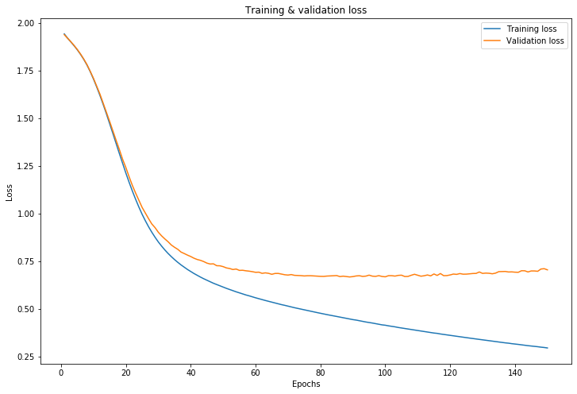
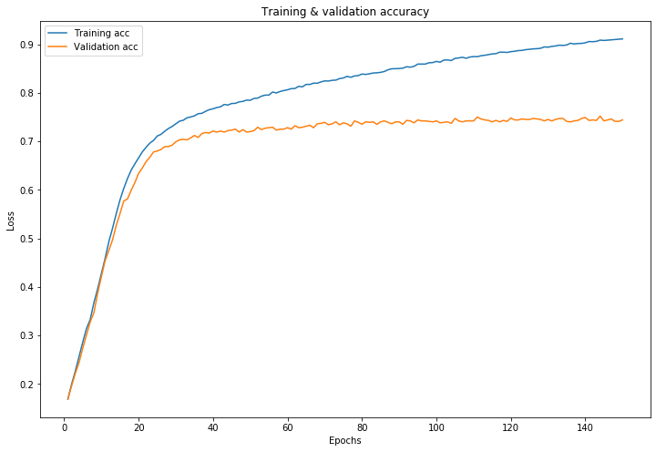
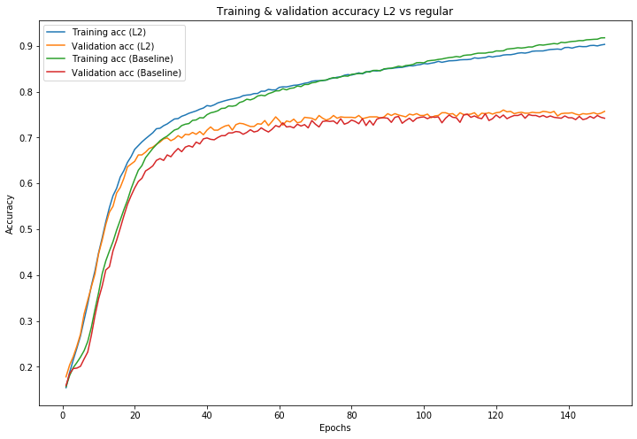

# Tuning Neural Networks with Regularization - Lab 

## Introduction

In this lab, you'll use a train-test partition as well as a validation set to get better insights about how to tune neural networks using regularization techniques. You'll start by repeating the process from the last section: importing the data and performing preprocessing including one-hot encoding. From there, you'll define and compile the model like before. 

## Objectives

You will be able to:

- Apply early stopping criteria with a neural network 
- Apply L1, L2, and dropout regularization on a neural network  
- Examine the effects of training with more data on a neural network  


## Load the Data

Run the following cell to import some of the libraries and classes you'll need in this lab. 


```python
import pandas as pd
import numpy as np
import random
import matplotlib.pyplot as plt
%matplotlib inline
from sklearn.model_selection import train_test_split
from keras.utils.np_utils import to_categorical
from sklearn.preprocessing import LabelBinarizer
from keras.preprocessing.text import Tokenizer

import warnings
warnings.filterwarnings('ignore')
```

    Using TensorFlow backend.


The data is stored in the file `'Bank_complaints.csv'`. Load and preview the dataset.


```python
# Load and preview the dataset
df = pd.read_csv('Bank_complaints.csv')
df.head()
```


<div>
<style scoped>
    .dataframe tbody tr th:only-of-type {
        vertical-align: middle;
    }

    .dataframe tbody tr th {
        vertical-align: top;
    }

    .dataframe thead th {
        text-align: right;
    }
</style>
<table border="1" class="dataframe">
  <thead>
    <tr style="text-align: right;">
      <th></th>
      <th>Product</th>
      <th>Consumer complaint narrative</th>
    </tr>
  </thead>
  <tbody>
    <tr>
      <th>0</th>
      <td>Student loan</td>
      <td>In XX/XX/XXXX I filled out the Fedlaon applica...</td>
    </tr>
    <tr>
      <th>1</th>
      <td>Student loan</td>
      <td>I am being contacted by a debt collector for p...</td>
    </tr>
    <tr>
      <th>2</th>
      <td>Student loan</td>
      <td>I cosigned XXXX student loans at SallieMae for...</td>
    </tr>
    <tr>
      <th>3</th>
      <td>Student loan</td>
      <td>Navient has sytematically and illegally failed...</td>
    </tr>
    <tr>
      <th>4</th>
      <td>Student loan</td>
      <td>My wife became eligible for XXXX Loan Forgiven...</td>
    </tr>
  </tbody>
</table>
</div>


## Preprocessing Overview

Before you begin to practice some of your new tools such as regularization and optimization, let's practice munging some data as you did in the previous section with bank complaints. Recall some techniques:

* Sampling in order to reduce training time (investigate model accuracy vs data size later on)
* Train - test split
* One-hot encoding your complaint text
* Transforming your category labels 

## Preprocessing: Generate a Random Sample

Since you have quite a bit of data and training neural networks takes a substantial amount of time and resources, downsample in order to test your initial pipeline. Going forward, these can be interesting areas of investigation: how does your model's performance change as you increase (or decrease) the size of your dataset?  

- Generate a random sample of 10,000 observations using seed 123 for consistency of results. 
- Split this sample into `X` and `y` 


```python
# Downsample the data
df_sample = df.sample(10000, random_state=123)

# Split the data into X and y
y = df_sample['Product']
X = df_sample['Consumer complaint narrative']
```

## Train-test split

- Split the data into training and test sets 
- Assign 1500 obervations to the test set and use 42 as the seed 


```python
# Split data into training and test sets
X_train, X_test, y_train, y_test = train_test_split(X, y, test_size=1500, random_state=42)
```

## Validation set 

As mentioned in the previous lesson, it is good practice to set aside a validation set, which is then used during hyperparameter tuning. Afterwards, when you have decided upon a final model, the test set can then be used to determine an unbiased perforance of the model. 

Run the cell below to further divide the training data into training and validation sets. 


```python
# Split the data into training and validation sets
X_train_final, X_val, y_train_final, y_val = train_test_split(X_train, y_train, test_size=1000, random_state=42)
```

## Preprocessing: One-hot Encoding the Complaints

As before, you need to do some preprocessing before building a neural network model. 

- Keep the 2,000 most common words and use one-hot encoding to reformat the complaints into a matrix of vectors 
- Transform the training, validate, and test sets 


```python
# Use one-hot encoding to reformat the complaints into a matrix of vectors 
# Only keep the 2000 most common words 

tokenizer = Tokenizer(num_words=2000)
tokenizer.fit_on_texts(X_train_final)

X_train_tokens = tokenizer.texts_to_matrix(X_train_final, mode='binary')
X_val_tokens = tokenizer.texts_to_matrix(X_val, mode='binary')
X_test_tokens = tokenizer.texts_to_matrix(X_test, mode='binary')
```

## Preprocessing: Encoding the Products

Similarly, now transform the descriptive product labels to integers labels. After transforming them to integer labels, retransform them into a matrix of binary flags, one for each of the various product labels.  
  
> **Note**: This is similar to your previous work with dummy variables. Each of the various product categories will be its own column, and each observation will be a row. In turn, each of these observation rows will have a 1 in the column associated with it's label, and all other entries for the row will be zero. 

Transform the training, validate, and test sets. 


```python
# Transform the product labels to numerical values
lb = LabelBinarizer()
lb.fit(y_train_final)

y_train_lb = to_categorical(lb.transform(y_train_final))[:, :, 1]
y_val_lb = to_categorical(lb.transform(y_val))[:, :, 1]
y_test_lb = to_categorical(lb.transform(y_test))[:, :, 1]
```

## A Baseline Model 

Rebuild a fully connected (Dense) layer network:  
- Use 2 hidden layers with 50 units in the first and 25 in the second layer, both with `'relu'` activation functions (since you are dealing with a multiclass problem, classifying the complaints into 7 classes) 
- Use a `'softmax'` activation function for the output layer  


```python
# Build a baseline neural network model using Keras
random.seed(123)
from keras import models
from keras import layers
baseline_model = models.Sequential()
baseline_model.add(layers.Dense(50, activation='relu', input_shape=(2000,)))
baseline_model.add(layers.Dense(25, activation='relu'))
baseline_model.add(layers.Dense(7, activation='softmax'))
```

    WARNING:tensorflow:From //anaconda3/lib/python3.7/site-packages/keras/backend/tensorflow_backend.py:74: The name tf.get_default_graph is deprecated. Please use tf.compat.v1.get_default_graph instead.
    
    WARNING:tensorflow:From //anaconda3/lib/python3.7/site-packages/keras/backend/tensorflow_backend.py:517: The name tf.placeholder is deprecated. Please use tf.compat.v1.placeholder instead.
    
    WARNING:tensorflow:From //anaconda3/lib/python3.7/site-packages/keras/backend/tensorflow_backend.py:4138: The name tf.random_uniform is deprecated. Please use tf.random.uniform instead.
    


### Compile the Model

Compile this model with: 

- a stochastic gradient descent optimizer 
- `'categorical_crossentropy'` as the loss function 
- a focus on `'accuracy'` 


```python
# Compile the model
baseline_model.compile(optimizer='SGD', 
                       loss='categorical_crossentropy', 
                       metrics=['accuracy'])
```

    WARNING:tensorflow:From //anaconda3/lib/python3.7/site-packages/keras/optimizers.py:790: The name tf.train.Optimizer is deprecated. Please use tf.compat.v1.train.Optimizer instead.
    
    WARNING:tensorflow:From //anaconda3/lib/python3.7/site-packages/keras/backend/tensorflow_backend.py:3295: The name tf.log is deprecated. Please use tf.math.log instead.
    


### Train the Model

- Train the model for 150 epochs in mini-batches of 256 samples 
- Include the `validation_data` argument to ensure you keep track of the validation loss  


```python
# Train the model
baseline_model_val = baseline_model.fit(X_train_tokens, 
                                        y_train_lb, 
                                        epochs=150, 
                                        batch_size=256, 
                                        validation_data=(X_val_tokens, y_val_lb))
```

    WARNING:tensorflow:From //anaconda3/lib/python3.7/site-packages/tensorflow/python/ops/math_grad.py:1250: add_dispatch_support.<locals>.wrapper (from tensorflow.python.ops.array_ops) is deprecated and will be removed in a future version.
    Instructions for updating:
    Use tf.where in 2.0, which has the same broadcast rule as np.where
    WARNING:tensorflow:From //anaconda3/lib/python3.7/site-packages/keras/backend/tensorflow_backend.py:986: The name tf.assign_add is deprecated. Please use tf.compat.v1.assign_add instead.
    
    Train on 7500 samples, validate on 1000 samples
    Epoch 1/150
    7500/7500 [==============================] - 1s 114us/step - loss: 1.9437 - acc: 0.1687 - val_loss: 1.9396 - val_acc: 0.1690
    Epoch 2/150
    7500/7500 [==============================] - 0s 22us/step - loss: 1.9218 - acc: 0.1996 - val_loss: 1.9211 - val_acc: 0.1960
    Epoch 3/150
    7500/7500 [==============================] - 0s 21us/step - loss: 1.9022 - acc: 0.2267 - val_loss: 1.9033 - val_acc: 0.2220
    Epoch 4/150
    7500/7500 [==============================] - 0s 21us/step - loss: 1.8821 - acc: 0.2567 - val_loss: 1.8835 - val_acc: 0.2440
    Epoch 5/150
    7500/7500 [==============================] - 0s 21us/step - loss: 1.8606 - acc: 0.2861 - val_loss: 1.8622 - val_acc: 0.2740
    Epoch 6/150
    7500/7500 [==============================] - 0s 20us/step - loss: 1.8368 - acc: 0.3143 - val_loss: 1.8383 - val_acc: 0.3010
    Epoch 7/150
    7500/7500 [==============================] - 0s 20us/step - loss: 1.8103 - acc: 0.3329 - val_loss: 1.8117 - val_acc: 0.3280
    Epoch 8/150
    7500/7500 [==============================] - 0s 21us/step - loss: 1.7802 - acc: 0.3677 - val_loss: 1.7826 - val_acc: 0.3470
    Epoch 9/150
    7500/7500 [==============================] - ETA: 0s - loss: 1.7484 - acc: 0.390 - 0s 20us/step - loss: 1.7456 - acc: 0.3961 - val_loss: 1.7474 - val_acc: 0.3870
    Epoch 10/150
    7500/7500 [==============================] - 0s 20us/step - loss: 1.7069 - acc: 0.4271 - val_loss: 1.7106 - val_acc: 0.4210
    Epoch 11/150
    7500/7500 [==============================] - 0s 21us/step - loss: 1.6650 - acc: 0.4587 - val_loss: 1.6688 - val_acc: 0.4540
    Epoch 12/150
    7500/7500 [==============================] - 0s 21us/step - loss: 1.6205 - acc: 0.4931 - val_loss: 1.6277 - val_acc: 0.4750
    Epoch 13/150
    7500/7500 [==============================] - 0s 20us/step - loss: 1.5733 - acc: 0.5209 - val_loss: 1.5802 - val_acc: 0.4970
    Epoch 14/150
    7500/7500 [==============================] - 0s 20us/step - loss: 1.5236 - acc: 0.5512 - val_loss: 1.5319 - val_acc: 0.5270
    Epoch 15/150
    7500/7500 [==============================] - 0s 20us/step - loss: 1.4723 - acc: 0.5792 - val_loss: 1.4839 - val_acc: 0.5510
    Epoch 16/150
    7500/7500 [==============================] - 0s 21us/step - loss: 1.4203 - acc: 0.6027 - val_loss: 1.4341 - val_acc: 0.5770
    Epoch 17/150
    7500/7500 [==============================] - 0s 20us/step - loss: 1.3674 - acc: 0.6231 - val_loss: 1.3847 - val_acc: 0.5810
    Epoch 18/150
    7500/7500 [==============================] - 0s 20us/step - loss: 1.3150 - acc: 0.6404 - val_loss: 1.3364 - val_acc: 0.5990
    Epoch 19/150
    7500/7500 [==============================] - 0s 20us/step - loss: 1.2634 - acc: 0.6536 - val_loss: 1.2854 - val_acc: 0.6150
    Epoch 20/150
    7500/7500 [==============================] - 0s 20us/step - loss: 1.2131 - acc: 0.6660 - val_loss: 1.2421 - val_acc: 0.6340
    Epoch 21/150
    7500/7500 [==============================] - 0s 20us/step - loss: 1.1648 - acc: 0.6781 - val_loss: 1.1937 - val_acc: 0.6450
    Epoch 22/150
    7500/7500 [==============================] - 0s 20us/step - loss: 1.1191 - acc: 0.6876 - val_loss: 1.1485 - val_acc: 0.6580
    Epoch 23/150
    7500/7500 [==============================] - 0s 20us/step - loss: 1.0760 - acc: 0.6961 - val_loss: 1.1086 - val_acc: 0.6670
    Epoch 24/150
    7500/7500 [==============================] - 0s 20us/step - loss: 1.0353 - acc: 0.7017 - val_loss: 1.0716 - val_acc: 0.6780
    Epoch 25/150
    7500/7500 [==============================] - 0s 20us/step - loss: 0.9974 - acc: 0.7108 - val_loss: 1.0335 - val_acc: 0.6800
    Epoch 26/150
    7500/7500 [==============================] - 0s 20us/step - loss: 0.9634 - acc: 0.7143 - val_loss: 1.0040 - val_acc: 0.6830
    Epoch 27/150
    7500/7500 [==============================] - 0s 20us/step - loss: 0.9317 - acc: 0.7205 - val_loss: 0.9741 - val_acc: 0.6890
    Epoch 28/150
    7500/7500 [==============================] - 0s 21us/step - loss: 0.9030 - acc: 0.7263 - val_loss: 0.9464 - val_acc: 0.6890
    Epoch 29/150
    7500/7500 [==============================] - 0s 21us/step - loss: 0.8767 - acc: 0.7305 - val_loss: 0.9271 - val_acc: 0.6920
    Epoch 30/150
    7500/7500 [==============================] - 0s 20us/step - loss: 0.8522 - acc: 0.7360 - val_loss: 0.9031 - val_acc: 0.6990
    Epoch 31/150
    7500/7500 [==============================] - 0s 21us/step - loss: 0.8306 - acc: 0.7415 - val_loss: 0.8843 - val_acc: 0.7030
    Epoch 32/150
    7500/7500 [==============================] - 0s 21us/step - loss: 0.8104 - acc: 0.7433 - val_loss: 0.8682 - val_acc: 0.7040
    Epoch 33/150
    7500/7500 [==============================] - 0s 20us/step - loss: 0.7920 - acc: 0.7484 - val_loss: 0.8534 - val_acc: 0.7030
    Epoch 34/150
    7500/7500 [==============================] - 0s 21us/step - loss: 0.7753 - acc: 0.7501 - val_loss: 0.8363 - val_acc: 0.7070
    Epoch 35/150
    7500/7500 [==============================] - 0s 20us/step - loss: 0.7596 - acc: 0.7524 - val_loss: 0.8242 - val_acc: 0.7120
    Epoch 36/150
    7500/7500 [==============================] - 0s 20us/step - loss: 0.7452 - acc: 0.7568 - val_loss: 0.8135 - val_acc: 0.7080
    Epoch 37/150
    7500/7500 [==============================] - 0s 20us/step - loss: 0.7318 - acc: 0.7576 - val_loss: 0.7991 - val_acc: 0.7160
    Epoch 38/150
    7500/7500 [==============================] - 0s 20us/step - loss: 0.7197 - acc: 0.7617 - val_loss: 0.7913 - val_acc: 0.7180
    Epoch 39/150
    7500/7500 [==============================] - 0s 21us/step - loss: 0.7077 - acc: 0.7652 - val_loss: 0.7830 - val_acc: 0.7170
    Epoch 40/150
    7500/7500 [==============================] - 0s 20us/step - loss: 0.6972 - acc: 0.7669 - val_loss: 0.7757 - val_acc: 0.7210
    Epoch 41/150
    7500/7500 [==============================] - 0s 20us/step - loss: 0.6865 - acc: 0.7695 - val_loss: 0.7668 - val_acc: 0.7190
    Epoch 42/150
    7500/7500 [==============================] - 0s 20us/step - loss: 0.6772 - acc: 0.7711 - val_loss: 0.7601 - val_acc: 0.7210
    Epoch 43/150
    7500/7500 [==============================] - 0s 20us/step - loss: 0.6678 - acc: 0.7759 - val_loss: 0.7557 - val_acc: 0.7190
    Epoch 44/150
    7500/7500 [==============================] - 0s 20us/step - loss: 0.6591 - acc: 0.7747 - val_loss: 0.7492 - val_acc: 0.7220
    Epoch 45/150
    7500/7500 [==============================] - 0s 21us/step - loss: 0.6511 - acc: 0.7779 - val_loss: 0.7410 - val_acc: 0.7230
    Epoch 46/150
    7500/7500 [==============================] - 0s 20us/step - loss: 0.6432 - acc: 0.7781 - val_loss: 0.7364 - val_acc: 0.7250
    Epoch 47/150
    7500/7500 [==============================] - 0s 20us/step - loss: 0.6355 - acc: 0.7812 - val_loss: 0.7374 - val_acc: 0.7190
    Epoch 48/150
    7500/7500 [==============================] - 0s 20us/step - loss: 0.6287 - acc: 0.7821 - val_loss: 0.7276 - val_acc: 0.7240
    Epoch 49/150
    7500/7500 [==============================] - 0s 20us/step - loss: 0.6217 - acc: 0.7848 - val_loss: 0.7270 - val_acc: 0.7190
    Epoch 50/150
    7500/7500 [==============================] - 0s 20us/step - loss: 0.6153 - acc: 0.7845 - val_loss: 0.7226 - val_acc: 0.7200
    Epoch 51/150
    7500/7500 [==============================] - 0s 20us/step - loss: 0.6087 - acc: 0.7883 - val_loss: 0.7159 - val_acc: 0.7220
    Epoch 52/150
    7500/7500 [==============================] - 0s 21us/step - loss: 0.6025 - acc: 0.7889 - val_loss: 0.7128 - val_acc: 0.7290
    Epoch 53/150
    7500/7500 [==============================] - 0s 20us/step - loss: 0.5964 - acc: 0.7929 - val_loss: 0.7075 - val_acc: 0.7240
    Epoch 54/150
    7500/7500 [==============================] - 0s 20us/step - loss: 0.5906 - acc: 0.7951 - val_loss: 0.7101 - val_acc: 0.7270
    Epoch 55/150
    7500/7500 [==============================] - 0s 20us/step - loss: 0.5853 - acc: 0.7952 - val_loss: 0.7030 - val_acc: 0.7280
    Epoch 56/150
    7500/7500 [==============================] - 0s 20us/step - loss: 0.5797 - acc: 0.8015 - val_loss: 0.7037 - val_acc: 0.7290
    Epoch 57/150
    7500/7500 [==============================] - 0s 20us/step - loss: 0.5741 - acc: 0.7996 - val_loss: 0.7010 - val_acc: 0.7230
    Epoch 58/150
    7500/7500 [==============================] - 0s 20us/step - loss: 0.5695 - acc: 0.8025 - val_loss: 0.6989 - val_acc: 0.7250
    Epoch 59/150
    7500/7500 [==============================] - 0s 21us/step - loss: 0.5641 - acc: 0.8045 - val_loss: 0.6963 - val_acc: 0.7250
    Epoch 60/150
    7500/7500 [==============================] - 0s 20us/step - loss: 0.5592 - acc: 0.8061 - val_loss: 0.6929 - val_acc: 0.7280
    Epoch 61/150
    7500/7500 [==============================] - 0s 20us/step - loss: 0.5544 - acc: 0.8084 - val_loss: 0.6936 - val_acc: 0.7250
    Epoch 62/150
    7500/7500 [==============================] - 0s 21us/step - loss: 0.5497 - acc: 0.8088 - val_loss: 0.6874 - val_acc: 0.7320
    Epoch 63/150
    7500/7500 [==============================] - 0s 21us/step - loss: 0.5451 - acc: 0.8132 - val_loss: 0.6900 - val_acc: 0.7280
    Epoch 64/150
    7500/7500 [==============================] - 0s 20us/step - loss: 0.5407 - acc: 0.8121 - val_loss: 0.6876 - val_acc: 0.7290
    Epoch 65/150
    7500/7500 [==============================] - 0s 20us/step - loss: 0.5361 - acc: 0.8172 - val_loss: 0.6825 - val_acc: 0.7310
    Epoch 66/150
    7500/7500 [==============================] - 0s 20us/step - loss: 0.5319 - acc: 0.8171 - val_loss: 0.6869 - val_acc: 0.7330
    Epoch 67/150
    7500/7500 [==============================] - 0s 20us/step - loss: 0.5277 - acc: 0.8197 - val_loss: 0.6871 - val_acc: 0.7280
    Epoch 68/150
    7500/7500 [==============================] - 0s 20us/step - loss: 0.5232 - acc: 0.8196 - val_loss: 0.6837 - val_acc: 0.7360
    Epoch 69/150
    7500/7500 [==============================] - 0s 20us/step - loss: 0.5196 - acc: 0.8224 - val_loss: 0.6801 - val_acc: 0.7370
    Epoch 70/150
    7500/7500 [==============================] - 0s 20us/step - loss: 0.5153 - acc: 0.8244 - val_loss: 0.6784 - val_acc: 0.7390
    Epoch 71/150
    7500/7500 [==============================] - 0s 20us/step - loss: 0.5110 - acc: 0.8241 - val_loss: 0.6811 - val_acc: 0.7340
    Epoch 72/150
    7500/7500 [==============================] - 0s 21us/step - loss: 0.5071 - acc: 0.8256 - val_loss: 0.6770 - val_acc: 0.7360
    Epoch 73/150
    7500/7500 [==============================] - 0s 21us/step - loss: 0.5036 - acc: 0.8260 - val_loss: 0.6764 - val_acc: 0.7400
    Epoch 74/150
    7500/7500 [==============================] - 0s 20us/step - loss: 0.5000 - acc: 0.8292 - val_loss: 0.6755 - val_acc: 0.7340
    Epoch 75/150
    7500/7500 [==============================] - 0s 20us/step - loss: 0.4962 - acc: 0.8304 - val_loss: 0.6738 - val_acc: 0.7380
    Epoch 76/150
    7500/7500 [==============================] - 0s 20us/step - loss: 0.4926 - acc: 0.8337 - val_loss: 0.6748 - val_acc: 0.7360
    Epoch 77/150
    7500/7500 [==============================] - 0s 20us/step - loss: 0.4889 - acc: 0.8319 - val_loss: 0.6749 - val_acc: 0.7310
    Epoch 78/150
    7500/7500 [==============================] - 0s 21us/step - loss: 0.4849 - acc: 0.8345 - val_loss: 0.6738 - val_acc: 0.7420
    Epoch 79/150
    7500/7500 [==============================] - 0s 20us/step - loss: 0.4814 - acc: 0.8353 - val_loss: 0.6726 - val_acc: 0.7390
    Epoch 80/150
    7500/7500 [==============================] - 0s 20us/step - loss: 0.4779 - acc: 0.8385 - val_loss: 0.6718 - val_acc: 0.7350
    Epoch 81/150
    7500/7500 [==============================] - 0s 20us/step - loss: 0.4746 - acc: 0.8377 - val_loss: 0.6715 - val_acc: 0.7400
    Epoch 82/150
    7500/7500 [==============================] - 0s 20us/step - loss: 0.4710 - acc: 0.8391 - val_loss: 0.6731 - val_acc: 0.7390
    Epoch 83/150
    7500/7500 [==============================] - 0s 20us/step - loss: 0.4679 - acc: 0.8407 - val_loss: 0.6738 - val_acc: 0.7400
    Epoch 84/150
    7500/7500 [==============================] - 0s 20us/step - loss: 0.4645 - acc: 0.8411 - val_loss: 0.6748 - val_acc: 0.7350
    Epoch 85/150
    7500/7500 [==============================] - 0s 20us/step - loss: 0.4612 - acc: 0.8420 - val_loss: 0.6758 - val_acc: 0.7400
    Epoch 86/150
    7500/7500 [==============================] - 0s 20us/step - loss: 0.4579 - acc: 0.8437 - val_loss: 0.6705 - val_acc: 0.7420
    Epoch 87/150
    7500/7500 [==============================] - 0s 20us/step - loss: 0.4544 - acc: 0.8473 - val_loss: 0.6727 - val_acc: 0.7390
    Epoch 88/150
    7500/7500 [==============================] - 0s 20us/step - loss: 0.4512 - acc: 0.8493 - val_loss: 0.6705 - val_acc: 0.7360
    Epoch 89/150
    7500/7500 [==============================] - 0s 20us/step - loss: 0.4483 - acc: 0.8496 - val_loss: 0.6686 - val_acc: 0.7400
    Epoch 90/150
    7500/7500 [==============================] - 0s 20us/step - loss: 0.4447 - acc: 0.8499 - val_loss: 0.6704 - val_acc: 0.7400
    Epoch 91/150
    7500/7500 [==============================] - 0s 21us/step - loss: 0.4422 - acc: 0.8507 - val_loss: 0.6737 - val_acc: 0.7350
    Epoch 92/150
    7500/7500 [==============================] - 0s 21us/step - loss: 0.4389 - acc: 0.8536 - val_loss: 0.6750 - val_acc: 0.7430
    Epoch 93/150
    7500/7500 [==============================] - 0s 20us/step - loss: 0.4355 - acc: 0.8527 - val_loss: 0.6714 - val_acc: 0.7420
    Epoch 94/150
    7500/7500 [==============================] - 0s 20us/step - loss: 0.4322 - acc: 0.8544 - val_loss: 0.6729 - val_acc: 0.7380
    Epoch 95/150
    7500/7500 [==============================] - 0s 21us/step - loss: 0.4296 - acc: 0.8591 - val_loss: 0.6781 - val_acc: 0.7440
    Epoch 96/150
    7500/7500 [==============================] - 0s 20us/step - loss: 0.4268 - acc: 0.8591 - val_loss: 0.6728 - val_acc: 0.7420
    Epoch 97/150
    7500/7500 [==============================] - 0s 20us/step - loss: 0.4236 - acc: 0.8591 - val_loss: 0.6715 - val_acc: 0.7420
    Epoch 98/150
    7500/7500 [==============================] - 0s 20us/step - loss: 0.4208 - acc: 0.8617 - val_loss: 0.6754 - val_acc: 0.7410
    Epoch 99/150
    7500/7500 [==============================] - 0s 21us/step - loss: 0.4172 - acc: 0.8621 - val_loss: 0.6710 - val_acc: 0.7400
    Epoch 100/150
    7500/7500 [==============================] - 0s 21us/step - loss: 0.4152 - acc: 0.8645 - val_loss: 0.6693 - val_acc: 0.7420
    Epoch 101/150
    7500/7500 [==============================] - 0s 20us/step - loss: 0.4120 - acc: 0.8629 - val_loss: 0.6753 - val_acc: 0.7380
    Epoch 102/150
    7500/7500 [==============================] - 0s 20us/step - loss: 0.4093 - acc: 0.8673 - val_loss: 0.6752 - val_acc: 0.7390
    Epoch 103/150
    7500/7500 [==============================] - 0s 21us/step - loss: 0.4068 - acc: 0.8676 - val_loss: 0.6731 - val_acc: 0.7400
    Epoch 104/150
    7500/7500 [==============================] - 0s 21us/step - loss: 0.4034 - acc: 0.8664 - val_loss: 0.6768 - val_acc: 0.7370
    Epoch 105/150
    7500/7500 [==============================] - 0s 21us/step - loss: 0.4008 - acc: 0.8708 - val_loss: 0.6778 - val_acc: 0.7470
    Epoch 106/150
    7500/7500 [==============================] - 0s 20us/step - loss: 0.3984 - acc: 0.8717 - val_loss: 0.6709 - val_acc: 0.7420
    Epoch 107/150
    7500/7500 [==============================] - 0s 20us/step - loss: 0.3956 - acc: 0.8731 - val_loss: 0.6713 - val_acc: 0.7400
    Epoch 108/150
    7500/7500 [==============================] - 0s 21us/step - loss: 0.3931 - acc: 0.8711 - val_loss: 0.6774 - val_acc: 0.7420
    Epoch 109/150
    7500/7500 [==============================] - 0s 21us/step - loss: 0.3902 - acc: 0.8736 - val_loss: 0.6826 - val_acc: 0.7420
    Epoch 110/150
    7500/7500 [==============================] - 0s 20us/step - loss: 0.3879 - acc: 0.8745 - val_loss: 0.6774 - val_acc: 0.7420
    Epoch 111/150
    7500/7500 [==============================] - 0s 20us/step - loss: 0.3846 - acc: 0.8743 - val_loss: 0.6724 - val_acc: 0.7500
    Epoch 112/150
    7500/7500 [==============================] - 0s 21us/step - loss: 0.3826 - acc: 0.8763 - val_loss: 0.6749 - val_acc: 0.7460
    Epoch 113/150
    7500/7500 [==============================] - 0s 21us/step - loss: 0.3799 - acc: 0.8772 - val_loss: 0.6790 - val_acc: 0.7440
    Epoch 114/150
    7500/7500 [==============================] - 0s 20us/step - loss: 0.3774 - acc: 0.8785 - val_loss: 0.6743 - val_acc: 0.7430
    Epoch 115/150
    7500/7500 [==============================] - 0s 21us/step - loss: 0.3743 - acc: 0.8800 - val_loss: 0.6842 - val_acc: 0.7400
    Epoch 116/150
    7500/7500 [==============================] - 0s 20us/step - loss: 0.3725 - acc: 0.8805 - val_loss: 0.6765 - val_acc: 0.7430
    Epoch 117/150
    7500/7500 [==============================] - 0s 20us/step - loss: 0.3693 - acc: 0.8836 - val_loss: 0.6865 - val_acc: 0.7400
    Epoch 118/150
    7500/7500 [==============================] - 0s 20us/step - loss: 0.3669 - acc: 0.8836 - val_loss: 0.6753 - val_acc: 0.7430
    Epoch 119/150
    7500/7500 [==============================] - 0s 20us/step - loss: 0.3646 - acc: 0.8831 - val_loss: 0.6758 - val_acc: 0.7410
    Epoch 120/150
    7500/7500 [==============================] - 0s 21us/step - loss: 0.3622 - acc: 0.8847 - val_loss: 0.6791 - val_acc: 0.7480
    Epoch 121/150
    7500/7500 [==============================] - 0s 21us/step - loss: 0.3595 - acc: 0.8855 - val_loss: 0.6837 - val_acc: 0.7440
    Epoch 122/150
    7500/7500 [==============================] - 0s 20us/step - loss: 0.3572 - acc: 0.8869 - val_loss: 0.6821 - val_acc: 0.7440
    Epoch 123/150
    7500/7500 [==============================] - 0s 21us/step - loss: 0.3548 - acc: 0.8872 - val_loss: 0.6864 - val_acc: 0.7460
    Epoch 124/150
    7500/7500 [==============================] - 0s 20us/step - loss: 0.3525 - acc: 0.8888 - val_loss: 0.6831 - val_acc: 0.7450
    Epoch 125/150
    7500/7500 [==============================] - 0s 21us/step - loss: 0.3501 - acc: 0.8895 - val_loss: 0.6834 - val_acc: 0.7450
    Epoch 126/150
    7500/7500 [==============================] - 0s 20us/step - loss: 0.3477 - acc: 0.8904 - val_loss: 0.6849 - val_acc: 0.7470
    Epoch 127/150
    7500/7500 [==============================] - 0s 21us/step - loss: 0.3453 - acc: 0.8908 - val_loss: 0.6866 - val_acc: 0.7460
    Epoch 128/150
    7500/7500 [==============================] - 0s 21us/step - loss: 0.3431 - acc: 0.8916 - val_loss: 0.6871 - val_acc: 0.7450
    Epoch 129/150
    7500/7500 [==============================] - 0s 20us/step - loss: 0.3408 - acc: 0.8944 - val_loss: 0.6947 - val_acc: 0.7420
    Epoch 130/150
    7500/7500 [==============================] - 0s 20us/step - loss: 0.3387 - acc: 0.8939 - val_loss: 0.6872 - val_acc: 0.7450
    Epoch 131/150
    7500/7500 [==============================] - 0s 21us/step - loss: 0.3365 - acc: 0.8955 - val_loss: 0.6888 - val_acc: 0.7420
    Epoch 132/150
    7500/7500 [==============================] - 0s 21us/step - loss: 0.3341 - acc: 0.8964 - val_loss: 0.6879 - val_acc: 0.7450
    Epoch 133/150
    7500/7500 [==============================] - 0s 20us/step - loss: 0.3318 - acc: 0.8980 - val_loss: 0.6851 - val_acc: 0.7470
    Epoch 134/150
    7500/7500 [==============================] - 0s 20us/step - loss: 0.3297 - acc: 0.8975 - val_loss: 0.6886 - val_acc: 0.7470
    Epoch 135/150
    7500/7500 [==============================] - 0s 21us/step - loss: 0.3274 - acc: 0.8984 - val_loss: 0.6963 - val_acc: 0.7410
    Epoch 136/150
    7500/7500 [==============================] - 0s 20us/step - loss: 0.3248 - acc: 0.9020 - val_loss: 0.6967 - val_acc: 0.7400
    Epoch 137/150
    7500/7500 [==============================] - 0s 20us/step - loss: 0.3227 - acc: 0.9005 - val_loss: 0.6974 - val_acc: 0.7420
    Epoch 138/150
    7500/7500 [==============================] - 0s 20us/step - loss: 0.3210 - acc: 0.9015 - val_loss: 0.6946 - val_acc: 0.7430
    Epoch 139/150
    7500/7500 [==============================] - 0s 21us/step - loss: 0.3185 - acc: 0.9016 - val_loss: 0.6951 - val_acc: 0.7470
    Epoch 140/150
    7500/7500 [==============================] - 0s 20us/step - loss: 0.3167 - acc: 0.9029 - val_loss: 0.6936 - val_acc: 0.7490
    Epoch 141/150
    7500/7500 [==============================] - 0s 20us/step - loss: 0.3146 - acc: 0.9055 - val_loss: 0.6928 - val_acc: 0.7430
    Epoch 142/150
    7500/7500 [==============================] - 0s 20us/step - loss: 0.3124 - acc: 0.9052 - val_loss: 0.7011 - val_acc: 0.7440
    Epoch 143/150
    7500/7500 [==============================] - 0s 21us/step - loss: 0.3103 - acc: 0.9059 - val_loss: 0.7010 - val_acc: 0.7430
    Epoch 144/150
    7500/7500 [==============================] - 0s 21us/step - loss: 0.3080 - acc: 0.9084 - val_loss: 0.6947 - val_acc: 0.7520
    Epoch 145/150
    7500/7500 [==============================] - 0s 20us/step - loss: 0.3062 - acc: 0.9077 - val_loss: 0.7000 - val_acc: 0.7420
    Epoch 146/150
    7500/7500 [==============================] - 0s 20us/step - loss: 0.3042 - acc: 0.9084 - val_loss: 0.6999 - val_acc: 0.7440
    Epoch 147/150
    7500/7500 [==============================] - 0s 21us/step - loss: 0.3025 - acc: 0.9091 - val_loss: 0.6982 - val_acc: 0.7460
    Epoch 148/150
    7500/7500 [==============================] - 0s 21us/step - loss: 0.3001 - acc: 0.9097 - val_loss: 0.7101 - val_acc: 0.7410
    Epoch 149/150
    7500/7500 [==============================] - 0s 20us/step - loss: 0.2984 - acc: 0.9103 - val_loss: 0.7119 - val_acc: 0.7410
    Epoch 150/150
    7500/7500 [==============================] - 0s 20us/step - loss: 0.2960 - acc: 0.9109 - val_loss: 0.7058 - val_acc: 0.7440


### Model Performance

The attribute `.history` (stored as a dictionary) contains four entries now: one per metric that was being monitored during training and validation. Print the keys of this dictionary for confirmation: 


```python
# Access the history attribute and store the dictionary
baseline_model_val_dict = baseline_model_val.history

# Print the keys
baseline_model_val_dict.keys()
```


    dict_keys(['val_loss', 'val_acc', 'loss', 'acc'])


Evaluate this model on the training data: 


```python
results_train = baseline_model.evaluate(X_train_tokens, y_train_lb)
print('----------')
print(f'Training Loss: {results_train[0]:.3} \nTraining Accuracy: {results_train[1]:.3}')
```

    7500/7500 [==============================] - 0s 26us/step
    ----------
    Training Loss: 0.293 
    Training Accuracy: 0.913


Evaluate this model on the test data: 


```python
results_test = baseline_model.evaluate(X_test_tokens, y_test_lb)
print('----------')
print(f'Test Loss: {results_test[0]:.3} \nTest Accuracy: {results_test[1]:.3}')
```

    1500/1500 [==============================] - 0s 31us/step
    ----------
    Test Loss: 0.613 
    Test Accuracy: 0.779


### Plot the Results 

Plot the loss versus the number of epochs. Be sure to include the training and the validation loss in the same plot. 


```python
fig, ax = plt.subplots(figsize=(12, 8))

loss_values = baseline_model_val_dict['loss']
val_loss_values = baseline_model_val_dict['val_loss']

epochs = range(1, len(loss_values) + 1)
ax.plot(epochs, loss_values, label='Training loss')
ax.plot(epochs, val_loss_values, label='Validation loss')

ax.set_title('Training & validation loss')
ax.set_xlabel('Epochs')
ax.set_ylabel('Loss')
ax.legend();
```





Create a second plot comparing training and validation accuracy to the number of epochs. 


```python
fig, ax = plt.subplots(figsize=(12, 8))

acc_values = baseline_model_val_dict['acc'] 
val_acc_values = baseline_model_val_dict['val_acc']

ax.plot(epochs, acc_values, label='Training acc')
ax.plot(epochs, val_acc_values, label='Validation acc')
ax.set_title('Training & validation accuracy')
ax.set_xlabel('Epochs')
ax.set_ylabel('Loss')
ax.legend();
```





Did you notice an interesting pattern here? Although the training accuracy keeps increasing when going through more epochs, and the training loss keeps decreasing, the validation accuracy and loss don't necessarily do the same. After a certain point, validation accuracy keeps swinging, which means that you're probably **overfitting** the model to the training data when you train for many epochs past a certain dropoff point. Let's tackle this now. You will now specify an early stopping point when training your model. 


## Early Stopping

Overfitting neural networks is something you **_want_** to avoid at all costs. However, it's not possible to know in advance how many *epochs* you need to train your model on, and running the model multiple times with varying number of *epochs* maybe helpful, but is a time-consuming process. 

We've defined a model with the same architecture as above. This time specify an early stopping point when training the model. 


```python
random.seed(123)
model_2 = models.Sequential()
model_2.add(layers.Dense(50, activation='relu', input_shape=(2000,)))
model_2.add(layers.Dense(25, activation='relu'))
model_2.add(layers.Dense(7, activation='softmax'))

model_2.compile(optimizer='SGD', 
                loss='categorical_crossentropy', 
                metrics=['accuracy'])
```

- Import `EarlyStopping` and `ModelCheckpoint` from `keras.callbacks` 
- Define a list, `early_stopping`: 
  - Monitor `'val_loss'` and continue training for 10 epochs before stopping 
  - Save the best model while monitoring `'val_loss'` 
 
> If you need help, consult [documentation](https://keras.io/callbacks/).   


```python
# Import EarlyStopping and ModelCheckpoint
from keras.callbacks import EarlyStopping, ModelCheckpoint

# Define the callbacks
early_stopping = [EarlyStopping(monitor='val_loss', patience=10), 
                  ModelCheckpoint(filepath='best_model.h5', monitor='val_loss', save_best_only=True)]
```

Train `model_2`. Make sure you set the `callbacks` argument to `early_stopping`. 


```python
model_2_val = model_2.fit(X_train_tokens, 
                          y_train_lb, 
                          epochs=150, 
                          callbacks=early_stopping, 
                          batch_size=256, 
                          validation_data=(X_val_tokens, y_val_lb))
```

    Train on 7500 samples, validate on 1000 samples
    Epoch 1/150
    7500/7500 [==============================] - 1s 91us/step - loss: 1.9487 - acc: 0.1659 - val_loss: 1.9359 - val_acc: 0.1710
    Epoch 2/150
    7500/7500 [==============================] - 0s 21us/step - loss: 1.9253 - acc: 0.1999 - val_loss: 1.9178 - val_acc: 0.2040
    Epoch 3/150
    7500/7500 [==============================] - 0s 21us/step - loss: 1.9043 - acc: 0.2299 - val_loss: 1.8972 - val_acc: 0.2310
    Epoch 4/150
    7500/7500 [==============================] - 0s 21us/step - loss: 1.8801 - acc: 0.2572 - val_loss: 1.8715 - val_acc: 0.2700
    Epoch 5/150
    7500/7500 [==============================] - 0s 21us/step - loss: 1.8499 - acc: 0.2860 - val_loss: 1.8400 - val_acc: 0.2880
    Epoch 6/150
    7500/7500 [==============================] - 0s 21us/step - loss: 1.8128 - acc: 0.3184 - val_loss: 1.8008 - val_acc: 0.3120
    Epoch 7/150
    7500/7500 [==============================] - 0s 21us/step - loss: 1.7683 - acc: 0.3515 - val_loss: 1.7546 - val_acc: 0.3500
    Epoch 8/150
    7500/7500 [==============================] - 0s 21us/step - loss: 1.7173 - acc: 0.3835 - val_loss: 1.7025 - val_acc: 0.4020
    Epoch 9/150
    7500/7500 [==============================] - 0s 21us/step - loss: 1.6615 - acc: 0.4200 - val_loss: 1.6478 - val_acc: 0.4210
    Epoch 10/150
    7500/7500 [==============================] - 0s 21us/step - loss: 1.6039 - acc: 0.4496 - val_loss: 1.5912 - val_acc: 0.4600
    Epoch 11/150
    7500/7500 [==============================] - 0s 21us/step - loss: 1.5468 - acc: 0.4819 - val_loss: 1.5376 - val_acc: 0.4720
    Epoch 12/150
    7500/7500 [==============================] - 0s 21us/step - loss: 1.4900 - acc: 0.5100 - val_loss: 1.4827 - val_acc: 0.5040
    Epoch 13/150
    7500/7500 [==============================] - 0s 21us/step - loss: 1.4356 - acc: 0.5428 - val_loss: 1.4336 - val_acc: 0.5250
    Epoch 14/150
    7500/7500 [==============================] - 0s 21us/step - loss: 1.3829 - acc: 0.5672 - val_loss: 1.3809 - val_acc: 0.5580
    Epoch 15/150
    7500/7500 [==============================] - 0s 21us/step - loss: 1.3327 - acc: 0.5923 - val_loss: 1.3342 - val_acc: 0.5740
    Epoch 16/150
    7500/7500 [==============================] - 0s 21us/step - loss: 1.2855 - acc: 0.6073 - val_loss: 1.2903 - val_acc: 0.5820
    Epoch 17/150
    7500/7500 [==============================] - 0s 21us/step - loss: 1.2410 - acc: 0.6232 - val_loss: 1.2483 - val_acc: 0.6020
    Epoch 18/150
    7500/7500 [==============================] - 0s 21us/step - loss: 1.1988 - acc: 0.6371 - val_loss: 1.2086 - val_acc: 0.6110
    Epoch 19/150
    7500/7500 [==============================] - 0s 21us/step - loss: 1.1590 - acc: 0.6513 - val_loss: 1.1690 - val_acc: 0.6300
    Epoch 20/150
    7500/7500 [==============================] - 0s 21us/step - loss: 1.1219 - acc: 0.6591 - val_loss: 1.1405 - val_acc: 0.6250
    Epoch 21/150
    7500/7500 [==============================] - 0s 21us/step - loss: 1.0870 - acc: 0.6687 - val_loss: 1.1053 - val_acc: 0.6390
    Epoch 22/150
    7500/7500 [==============================] - 0s 21us/step - loss: 1.0546 - acc: 0.6741 - val_loss: 1.0737 - val_acc: 0.6520
    Epoch 23/150
    7500/7500 [==============================] - 0s 21us/step - loss: 1.0242 - acc: 0.6815 - val_loss: 1.0469 - val_acc: 0.6530
    Epoch 24/150
    7500/7500 [==============================] - 0s 21us/step - loss: 0.9960 - acc: 0.6873 - val_loss: 1.0199 - val_acc: 0.6730
    Epoch 25/150
    7500/7500 [==============================] - 0s 21us/step - loss: 0.9692 - acc: 0.6948 - val_loss: 0.9992 - val_acc: 0.6660
    Epoch 26/150
    7500/7500 [==============================] - 0s 21us/step - loss: 0.9444 - acc: 0.6992 - val_loss: 0.9735 - val_acc: 0.6790
    Epoch 27/150
    7500/7500 [==============================] - 0s 22us/step - loss: 0.9216 - acc: 0.7037 - val_loss: 0.9546 - val_acc: 0.6810
    Epoch 28/150
    7500/7500 [==============================] - 0s 22us/step - loss: 0.9001 - acc: 0.7076 - val_loss: 0.9333 - val_acc: 0.6830
    Epoch 29/150
    7500/7500 [==============================] - 0s 22us/step - loss: 0.8801 - acc: 0.7139 - val_loss: 0.9164 - val_acc: 0.6860
    Epoch 30/150
    7500/7500 [==============================] - 0s 22us/step - loss: 0.8612 - acc: 0.7179 - val_loss: 0.9003 - val_acc: 0.6850
    Epoch 31/150
    7500/7500 [==============================] - 0s 22us/step - loss: 0.8437 - acc: 0.7208 - val_loss: 0.8850 - val_acc: 0.6860
    Epoch 32/150
    7500/7500 [==============================] - 0s 23us/step - loss: 0.8269 - acc: 0.7301 - val_loss: 0.8722 - val_acc: 0.6890
    Epoch 33/150
    7500/7500 [==============================] - 0s 22us/step - loss: 0.8113 - acc: 0.7309 - val_loss: 0.8579 - val_acc: 0.6900
    Epoch 34/150
    7500/7500 [==============================] - 0s 22us/step - loss: 0.7965 - acc: 0.7347 - val_loss: 0.8462 - val_acc: 0.6940
    Epoch 35/150
    7500/7500 [==============================] - 0s 21us/step - loss: 0.7827 - acc: 0.7385 - val_loss: 0.8352 - val_acc: 0.6980
    Epoch 36/150
    7500/7500 [==============================] - 0s 22us/step - loss: 0.7700 - acc: 0.7408 - val_loss: 0.8209 - val_acc: 0.6980
    Epoch 37/150
    7500/7500 [==============================] - 0s 22us/step - loss: 0.7577 - acc: 0.7452 - val_loss: 0.8127 - val_acc: 0.7010
    Epoch 38/150
    7500/7500 [==============================] - 0s 21us/step - loss: 0.7457 - acc: 0.7484 - val_loss: 0.8071 - val_acc: 0.7040
    Epoch 39/150
    7500/7500 [==============================] - 0s 20us/step - loss: 0.7350 - acc: 0.7521 - val_loss: 0.7975 - val_acc: 0.7060
    Epoch 40/150
    7500/7500 [==============================] - 0s 20us/step - loss: 0.7243 - acc: 0.7524 - val_loss: 0.7873 - val_acc: 0.7130
    Epoch 41/150
    7500/7500 [==============================] - 0s 20us/step - loss: 0.7144 - acc: 0.7573 - val_loss: 0.7809 - val_acc: 0.7130
    Epoch 42/150
    7500/7500 [==============================] - 0s 20us/step - loss: 0.7050 - acc: 0.7587 - val_loss: 0.7730 - val_acc: 0.7110
    Epoch 43/150
    7500/7500 [==============================] - 0s 20us/step - loss: 0.6961 - acc: 0.7607 - val_loss: 0.7663 - val_acc: 0.7120
    Epoch 44/150
    7500/7500 [==============================] - 0s 21us/step - loss: 0.6870 - acc: 0.7641 - val_loss: 0.7588 - val_acc: 0.7170
    Epoch 45/150
    7500/7500 [==============================] - 0s 21us/step - loss: 0.6793 - acc: 0.7672 - val_loss: 0.7525 - val_acc: 0.7200
    Epoch 46/150
    7500/7500 [==============================] - 0s 20us/step - loss: 0.6705 - acc: 0.7692 - val_loss: 0.7477 - val_acc: 0.7250
    Epoch 47/150
    7500/7500 [==============================] - 0s 21us/step - loss: 0.6632 - acc: 0.7727 - val_loss: 0.7437 - val_acc: 0.7140
    Epoch 48/150
    7500/7500 [==============================] - 0s 20us/step - loss: 0.6557 - acc: 0.7736 - val_loss: 0.7363 - val_acc: 0.7160
    Epoch 49/150
    7500/7500 [==============================] - 0s 21us/step - loss: 0.6489 - acc: 0.7753 - val_loss: 0.7385 - val_acc: 0.7170
    Epoch 50/150
    7500/7500 [==============================] - 0s 20us/step - loss: 0.6415 - acc: 0.7772 - val_loss: 0.7317 - val_acc: 0.7190
    Epoch 51/150
    7500/7500 [==============================] - 0s 21us/step - loss: 0.6355 - acc: 0.7789 - val_loss: 0.7238 - val_acc: 0.7210
    Epoch 52/150
    7500/7500 [==============================] - 0s 21us/step - loss: 0.6290 - acc: 0.7817 - val_loss: 0.7254 - val_acc: 0.7210
    Epoch 53/150
    7500/7500 [==============================] - 0s 21us/step - loss: 0.6229 - acc: 0.7823 - val_loss: 0.7161 - val_acc: 0.7280
    Epoch 54/150
    7500/7500 [==============================] - 0s 21us/step - loss: 0.6165 - acc: 0.7867 - val_loss: 0.7148 - val_acc: 0.7300
    Epoch 55/150
    7500/7500 [==============================] - 0s 21us/step - loss: 0.6108 - acc: 0.7881 - val_loss: 0.7086 - val_acc: 0.7270
    Epoch 56/150
    7500/7500 [==============================] - 0s 20us/step - loss: 0.6047 - acc: 0.7881 - val_loss: 0.7084 - val_acc: 0.7270
    Epoch 57/150
    7500/7500 [==============================] - 0s 21us/step - loss: 0.5998 - acc: 0.7912 - val_loss: 0.7028 - val_acc: 0.7320
    Epoch 58/150
    7500/7500 [==============================] - 0s 21us/step - loss: 0.5942 - acc: 0.7941 - val_loss: 0.7067 - val_acc: 0.7250
    Epoch 59/150
    7500/7500 [==============================] - 0s 21us/step - loss: 0.5885 - acc: 0.7951 - val_loss: 0.6967 - val_acc: 0.7270
    Epoch 60/150
    7500/7500 [==============================] - 0s 22us/step - loss: 0.5838 - acc: 0.7999 - val_loss: 0.6943 - val_acc: 0.7290
    Epoch 61/150
    7500/7500 [==============================] - 0s 21us/step - loss: 0.5784 - acc: 0.7988 - val_loss: 0.6976 - val_acc: 0.7290
    Epoch 62/150
    7500/7500 [==============================] - 0s 21us/step - loss: 0.5738 - acc: 0.8024 - val_loss: 0.6909 - val_acc: 0.7300
    Epoch 63/150
    7500/7500 [==============================] - 0s 22us/step - loss: 0.5689 - acc: 0.8017 - val_loss: 0.6856 - val_acc: 0.7330
    Epoch 64/150
    7500/7500 [==============================] - 0s 22us/step - loss: 0.5646 - acc: 0.8071 - val_loss: 0.6886 - val_acc: 0.7280
    Epoch 65/150
    7500/7500 [==============================] - 0s 22us/step - loss: 0.5598 - acc: 0.8053 - val_loss: 0.6848 - val_acc: 0.7300
    Epoch 66/150
    7500/7500 [==============================] - 0s 22us/step - loss: 0.5548 - acc: 0.8075 - val_loss: 0.6809 - val_acc: 0.7330
    Epoch 67/150
    7500/7500 [==============================] - 0s 22us/step - loss: 0.5507 - acc: 0.8085 - val_loss: 0.6823 - val_acc: 0.7270
    Epoch 68/150
    7500/7500 [==============================] - 0s 21us/step - loss: 0.5463 - acc: 0.8127 - val_loss: 0.6797 - val_acc: 0.7310
    Epoch 69/150
    7500/7500 [==============================] - 0s 20us/step - loss: 0.5418 - acc: 0.8153 - val_loss: 0.6795 - val_acc: 0.7320
    Epoch 70/150
    7500/7500 [==============================] - 0s 21us/step - loss: 0.5378 - acc: 0.8143 - val_loss: 0.6741 - val_acc: 0.7310
    Epoch 71/150
    7500/7500 [==============================] - 0s 21us/step - loss: 0.5337 - acc: 0.8172 - val_loss: 0.6749 - val_acc: 0.7300
    Epoch 72/150
    7500/7500 [==============================] - 0s 22us/step - loss: 0.5298 - acc: 0.8201 - val_loss: 0.6698 - val_acc: 0.7390
    Epoch 73/150
    7500/7500 [==============================] - 0s 21us/step - loss: 0.5258 - acc: 0.8225 - val_loss: 0.6749 - val_acc: 0.7280
    Epoch 74/150
    7500/7500 [==============================] - 0s 20us/step - loss: 0.5222 - acc: 0.8212 - val_loss: 0.6701 - val_acc: 0.7340
    Epoch 75/150
    7500/7500 [==============================] - 0s 20us/step - loss: 0.5179 - acc: 0.8239 - val_loss: 0.6709 - val_acc: 0.7340
    Epoch 76/150
    7500/7500 [==============================] - 0s 21us/step - loss: 0.5138 - acc: 0.8240 - val_loss: 0.6686 - val_acc: 0.7320
    Epoch 77/150
    7500/7500 [==============================] - 0s 21us/step - loss: 0.5102 - acc: 0.8276 - val_loss: 0.6642 - val_acc: 0.7420
    Epoch 78/150
    7500/7500 [==============================] - 0s 20us/step - loss: 0.5066 - acc: 0.8307 - val_loss: 0.6658 - val_acc: 0.7400
    Epoch 79/150
    7500/7500 [==============================] - 0s 21us/step - loss: 0.5027 - acc: 0.8309 - val_loss: 0.6629 - val_acc: 0.7420
    Epoch 80/150
    7500/7500 [==============================] - 0s 21us/step - loss: 0.4990 - acc: 0.8317 - val_loss: 0.6634 - val_acc: 0.7340
    Epoch 81/150
    7500/7500 [==============================] - 0s 20us/step - loss: 0.4954 - acc: 0.8332 - val_loss: 0.6620 - val_acc: 0.7360
    Epoch 82/150
    7500/7500 [==============================] - 0s 20us/step - loss: 0.4921 - acc: 0.8329 - val_loss: 0.6614 - val_acc: 0.7360
    Epoch 83/150
    7500/7500 [==============================] - 0s 20us/step - loss: 0.4884 - acc: 0.8345 - val_loss: 0.6573 - val_acc: 0.7430
    Epoch 84/150
    7500/7500 [==============================] - 0s 20us/step - loss: 0.4851 - acc: 0.8357 - val_loss: 0.6560 - val_acc: 0.7460
    Epoch 85/150
    7500/7500 [==============================] - 0s 20us/step - loss: 0.4817 - acc: 0.8381 - val_loss: 0.6577 - val_acc: 0.7460
    Epoch 86/150
    7500/7500 [==============================] - 0s 21us/step - loss: 0.4783 - acc: 0.8380 - val_loss: 0.6555 - val_acc: 0.7500
    Epoch 87/150
    7500/7500 [==============================] - 0s 20us/step - loss: 0.4749 - acc: 0.8420 - val_loss: 0.6571 - val_acc: 0.7450
    Epoch 88/150
    7500/7500 [==============================] - 0s 20us/step - loss: 0.4717 - acc: 0.8409 - val_loss: 0.6562 - val_acc: 0.7440
    Epoch 89/150
    7500/7500 [==============================] - 0s 20us/step - loss: 0.4682 - acc: 0.8433 - val_loss: 0.6531 - val_acc: 0.7480
    Epoch 90/150
    7500/7500 [==============================] - 0s 21us/step - loss: 0.4650 - acc: 0.8421 - val_loss: 0.6545 - val_acc: 0.7390
    Epoch 91/150
    7500/7500 [==============================] - 0s 20us/step - loss: 0.4620 - acc: 0.8453 - val_loss: 0.6557 - val_acc: 0.7410
    Epoch 92/150
    7500/7500 [==============================] - 0s 20us/step - loss: 0.4586 - acc: 0.8455 - val_loss: 0.6549 - val_acc: 0.7450
    Epoch 93/150
    7500/7500 [==============================] - 0s 20us/step - loss: 0.4552 - acc: 0.8464 - val_loss: 0.6498 - val_acc: 0.7470
    Epoch 94/150
    7500/7500 [==============================] - 0s 20us/step - loss: 0.4526 - acc: 0.8483 - val_loss: 0.6499 - val_acc: 0.7540
    Epoch 95/150
    7500/7500 [==============================] - 0s 20us/step - loss: 0.4490 - acc: 0.8503 - val_loss: 0.6477 - val_acc: 0.7460
    Epoch 96/150
    7500/7500 [==============================] - 0s 21us/step - loss: 0.4462 - acc: 0.8511 - val_loss: 0.6475 - val_acc: 0.7480
    Epoch 97/150
    7500/7500 [==============================] - 0s 20us/step - loss: 0.4432 - acc: 0.8513 - val_loss: 0.6495 - val_acc: 0.7500
    Epoch 98/150
    7500/7500 [==============================] - 0s 21us/step - loss: 0.4402 - acc: 0.8531 - val_loss: 0.6487 - val_acc: 0.7540
    Epoch 99/150
    7500/7500 [==============================] - 0s 20us/step - loss: 0.4372 - acc: 0.8555 - val_loss: 0.6529 - val_acc: 0.7500
    Epoch 100/150
    7500/7500 [==============================] - 0s 20us/step - loss: 0.4341 - acc: 0.8556 - val_loss: 0.6494 - val_acc: 0.7480
    Epoch 101/150
    7500/7500 [==============================] - 0s 21us/step - loss: 0.4308 - acc: 0.8581 - val_loss: 0.6489 - val_acc: 0.7510
    Epoch 102/150
    7500/7500 [==============================] - 0s 20us/step - loss: 0.4279 - acc: 0.8593 - val_loss: 0.6501 - val_acc: 0.7480
    Epoch 103/150
    7500/7500 [==============================] - 0s 20us/step - loss: 0.4251 - acc: 0.8591 - val_loss: 0.6542 - val_acc: 0.7480
    Epoch 104/150
    7500/7500 [==============================] - 0s 21us/step - loss: 0.4224 - acc: 0.8615 - val_loss: 0.6504 - val_acc: 0.7510
    Epoch 105/150
    7500/7500 [==============================] - 0s 21us/step - loss: 0.4197 - acc: 0.8619 - val_loss: 0.6507 - val_acc: 0.7520
    Epoch 106/150
    7500/7500 [==============================] - 0s 21us/step - loss: 0.4167 - acc: 0.8637 - val_loss: 0.6503 - val_acc: 0.7500


Load the best (saved) model. 


```python
# Load the best (saved) model
from keras.models import load_model
saved_model = load_model('best_model.h5')
```

Now, use this model to to calculate the training and test accuracy: 


```python
results_train = saved_model.evaluate(X_train_tokens, y_train_lb)
print(f'Training Loss: {results_train[0]:.3} \nTraining Accuracy: {results_train[1]:.3}')

print('----------')

results_test = saved_model.evaluate(X_test_tokens, y_test_lb)
print(f'Test Loss: {results_test[0]:.3} \nTest Accuracy: {results_test[1]:.3}')
```

    7500/7500 [==============================] - 0s 40us/step
    Training Loss: 0.443 
    Training Accuracy: 0.851
    ----------
    1500/1500 [==============================] - 0s 23us/step
    Test Loss: 0.608 
    Test Accuracy: 0.779


Nicely done! Did you notice that the model didn't train for all 150 epochs? You reduced your training time. 

Now, take a look at how regularization techniques can further improve your model performance. 

## L2 Regularization 

First, take a look at L2 regularization. Keras makes L2 regularization easy. Simply add the `kernel_regularizer=keras.regularizers.l2(lambda_coeff)` parameter to any model layer. The `lambda_coeff` parameter determines the strength of the regularization you wish to perform. 

- Use 2 hidden layers with 50 units in the first and 25 in the second layer, both with `'relu'` activation functions 
- Add L2 regularization to both the hidden layers with 0.005 as the `lambda_coeff` 


```python
# Import regularizers
from keras import regularizers
random.seed(123)
L2_model = models.Sequential()

# Add the input and first hidden layer
L2_model.add(layers.Dense(50, activation='relu', kernel_regularizer=regularizers.l2(0.005), input_shape=(2000,)))

# Add another hidden layer
L2_model.add(layers.Dense(25, kernel_regularizer=regularizers.l2(0.005), activation='relu'))

# Add an output layer
L2_model.add(layers.Dense(7, activation='softmax'))

# Compile the model
L2_model.compile(optimizer='SGD', 
                 loss='categorical_crossentropy', 
                 metrics=['accuracy'])

# Train the model 
L2_model_val = L2_model.fit(X_train_tokens, 
                            y_train_lb, 
                            epochs=150, 
                            batch_size=256, 
                            validation_data=(X_val_tokens, y_val_lb))
```

    Train on 7500 samples, validate on 1000 samples
    Epoch 1/150
    7500/7500 [==============================] - 1s 112us/step - loss: 2.6185 - acc: 0.1372 - val_loss: 2.6050 - val_acc: 0.1520
    Epoch 2/150
    7500/7500 [==============================] - 0s 24us/step - loss: 2.5925 - acc: 0.1757 - val_loss: 2.5850 - val_acc: 0.1820
    Epoch 3/150
    7500/7500 [==============================] - 0s 24us/step - loss: 2.5736 - acc: 0.2081 - val_loss: 2.5683 - val_acc: 0.1910
    Epoch 4/150
    7500/7500 [==============================] - 0s 25us/step - loss: 2.5564 - acc: 0.2277 - val_loss: 2.5521 - val_acc: 0.2170
    Epoch 5/150
    7500/7500 [==============================] - 0s 24us/step - loss: 2.5392 - acc: 0.2437 - val_loss: 2.5358 - val_acc: 0.2380
    Epoch 6/150
    7500/7500 [==============================] - 0s 24us/step - loss: 2.5212 - acc: 0.2612 - val_loss: 2.5184 - val_acc: 0.2480
    Epoch 7/150
    7500/7500 [==============================] - 0s 24us/step - loss: 2.5018 - acc: 0.2813 - val_loss: 2.4994 - val_acc: 0.2630
    Epoch 8/150
    7500/7500 [==============================] - 0s 25us/step - loss: 2.4813 - acc: 0.2997 - val_loss: 2.4792 - val_acc: 0.2850
    Epoch 9/150
    7500/7500 [==============================] - 0s 24us/step - loss: 2.4589 - acc: 0.3248 - val_loss: 2.4574 - val_acc: 0.2980
    Epoch 10/150
    7500/7500 [==============================] - 0s 24us/step - loss: 2.4346 - acc: 0.3448 - val_loss: 2.4331 - val_acc: 0.3260
    Epoch 11/150
    7500/7500 [==============================] - 0s 24us/step - loss: 2.4087 - acc: 0.3685 - val_loss: 2.4072 - val_acc: 0.3440
    Epoch 12/150
    7500/7500 [==============================] - 0s 24us/step - loss: 2.3805 - acc: 0.3887 - val_loss: 2.3798 - val_acc: 0.3650
    Epoch 13/150
    7500/7500 [==============================] - 0s 24us/step - loss: 2.3499 - acc: 0.4141 - val_loss: 2.3488 - val_acc: 0.3810
    Epoch 14/150
    7500/7500 [==============================] - 0s 24us/step - loss: 2.3168 - acc: 0.4317 - val_loss: 2.3160 - val_acc: 0.4160
    Epoch 15/150
    7500/7500 [==============================] - 0s 23us/step - loss: 2.2812 - acc: 0.4604 - val_loss: 2.2812 - val_acc: 0.4400
    Epoch 16/150
    7500/7500 [==============================] - 0s 24us/step - loss: 2.2427 - acc: 0.4861 - val_loss: 2.2411 - val_acc: 0.4630
    Epoch 17/150
    7500/7500 [==============================] - 0s 24us/step - loss: 2.2015 - acc: 0.5073 - val_loss: 2.1993 - val_acc: 0.5010
    Epoch 18/150
    7500/7500 [==============================] - 0s 24us/step - loss: 2.1577 - acc: 0.5361 - val_loss: 2.1572 - val_acc: 0.5230
    Epoch 19/150
    7500/7500 [==============================] - 0s 24us/step - loss: 2.1122 - acc: 0.5541 - val_loss: 2.1106 - val_acc: 0.5490
    Epoch 20/150
    7500/7500 [==============================] - 0s 24us/step - loss: 2.0659 - acc: 0.5787 - val_loss: 2.0668 - val_acc: 0.5580
    Epoch 21/150
    7500/7500 [==============================] - 0s 24us/step - loss: 2.0191 - acc: 0.5963 - val_loss: 2.0229 - val_acc: 0.5730
    Epoch 22/150
    7500/7500 [==============================] - 0s 24us/step - loss: 1.9729 - acc: 0.6096 - val_loss: 1.9759 - val_acc: 0.5890
    Epoch 23/150
    7500/7500 [==============================] - 0s 24us/step - loss: 1.9268 - acc: 0.6273 - val_loss: 1.9308 - val_acc: 0.6110
    Epoch 24/150
    7500/7500 [==============================] - 0s 24us/step - loss: 1.8817 - acc: 0.6416 - val_loss: 1.8900 - val_acc: 0.6300
    Epoch 25/150
    7500/7500 [==============================] - 0s 24us/step - loss: 1.8384 - acc: 0.6527 - val_loss: 1.8480 - val_acc: 0.6370
    Epoch 26/150
    7500/7500 [==============================] - 0s 24us/step - loss: 1.7963 - acc: 0.6637 - val_loss: 1.8058 - val_acc: 0.6480
    Epoch 27/150
    7500/7500 [==============================] - 0s 24us/step - loss: 1.7559 - acc: 0.6771 - val_loss: 1.7664 - val_acc: 0.6560
    Epoch 28/150
    7500/7500 [==============================] - 0s 24us/step - loss: 1.7174 - acc: 0.6817 - val_loss: 1.7295 - val_acc: 0.6630
    Epoch 29/150
    7500/7500 [==============================] - 0s 24us/step - loss: 1.6809 - acc: 0.6933 - val_loss: 1.6961 - val_acc: 0.6740
    Epoch 30/150
    7500/7500 [==============================] - 0s 25us/step - loss: 1.6463 - acc: 0.6995 - val_loss: 1.6667 - val_acc: 0.6780
    Epoch 31/150
    7500/7500 [==============================] - 0s 24us/step - loss: 1.6141 - acc: 0.7051 - val_loss: 1.6305 - val_acc: 0.6910
    Epoch 32/150
    7500/7500 [==============================] - 0s 24us/step - loss: 1.5840 - acc: 0.7115 - val_loss: 1.6064 - val_acc: 0.6920
    Epoch 33/150
    7500/7500 [==============================] - 0s 24us/step - loss: 1.5557 - acc: 0.7147 - val_loss: 1.5778 - val_acc: 0.6990
    Epoch 34/150
    7500/7500 [==============================] - 0s 25us/step - loss: 1.5288 - acc: 0.7169 - val_loss: 1.5530 - val_acc: 0.6970
    Epoch 35/150
    7500/7500 [==============================] - 0s 24us/step - loss: 1.5038 - acc: 0.7235 - val_loss: 1.5293 - val_acc: 0.7130
    Epoch 36/150
    7500/7500 [==============================] - 0s 25us/step - loss: 1.4805 - acc: 0.7281 - val_loss: 1.5059 - val_acc: 0.7140
    Epoch 37/150
    7500/7500 [==============================] - 0s 23us/step - loss: 1.4585 - acc: 0.7313 - val_loss: 1.4888 - val_acc: 0.7140
    Epoch 38/150
    7500/7500 [==============================] - 0s 23us/step - loss: 1.4378 - acc: 0.7335 - val_loss: 1.4699 - val_acc: 0.7080
    Epoch 39/150
    7500/7500 [==============================] - 0s 23us/step - loss: 1.4188 - acc: 0.7395 - val_loss: 1.4538 - val_acc: 0.7100
    Epoch 40/150
    7500/7500 [==============================] - 0s 23us/step - loss: 1.4004 - acc: 0.7415 - val_loss: 1.4343 - val_acc: 0.7200
    Epoch 41/150
    7500/7500 [==============================] - 0s 24us/step - loss: 1.3834 - acc: 0.7471 - val_loss: 1.4185 - val_acc: 0.7240
    Epoch 42/150
    7500/7500 [==============================] - 0s 23us/step - loss: 1.3673 - acc: 0.7489 - val_loss: 1.4068 - val_acc: 0.7230
    Epoch 43/150
    7500/7500 [==============================] - 0s 23us/step - loss: 1.3520 - acc: 0.7529 - val_loss: 1.3948 - val_acc: 0.7180
    Epoch 44/150
    7500/7500 [==============================] - 0s 23us/step - loss: 1.3377 - acc: 0.7544 - val_loss: 1.3801 - val_acc: 0.7260
    Epoch 45/150
    7500/7500 [==============================] - 0s 23us/step - loss: 1.3238 - acc: 0.7573 - val_loss: 1.3688 - val_acc: 0.7190
    Epoch 46/150
    7500/7500 [==============================] - 0s 23us/step - loss: 1.3106 - acc: 0.7617 - val_loss: 1.3569 - val_acc: 0.7220
    Epoch 47/150
    7500/7500 [==============================] - 0s 23us/step - loss: 1.2984 - acc: 0.7648 - val_loss: 1.3487 - val_acc: 0.7280
    Epoch 48/150
    7500/7500 [==============================] - 0s 23us/step - loss: 1.2861 - acc: 0.7673 - val_loss: 1.3378 - val_acc: 0.7230
    Epoch 49/150
    7500/7500 [==============================] - 0s 24us/step - loss: 1.2749 - acc: 0.7661 - val_loss: 1.3266 - val_acc: 0.7220
    Epoch 50/150
    7500/7500 [==============================] - 0s 24us/step - loss: 1.2639 - acc: 0.7737 - val_loss: 1.3163 - val_acc: 0.7310
    Epoch 51/150
    7500/7500 [==============================] - 0s 25us/step - loss: 1.2533 - acc: 0.7731 - val_loss: 1.3115 - val_acc: 0.7230
    Epoch 52/150
    7500/7500 [==============================] - 0s 24us/step - loss: 1.2431 - acc: 0.7755 - val_loss: 1.3021 - val_acc: 0.7270
    Epoch 53/150
    7500/7500 [==============================] - 0s 24us/step - loss: 1.2335 - acc: 0.7785 - val_loss: 1.2939 - val_acc: 0.7310
    Epoch 54/150
    7500/7500 [==============================] - 0s 24us/step - loss: 1.2240 - acc: 0.7804 - val_loss: 1.2857 - val_acc: 0.7300
    Epoch 55/150
    7500/7500 [==============================] - 0s 23us/step - loss: 1.2147 - acc: 0.7832 - val_loss: 1.2795 - val_acc: 0.7280
    Epoch 56/150
    7500/7500 [==============================] - 0s 24us/step - loss: 1.2059 - acc: 0.7833 - val_loss: 1.2782 - val_acc: 0.7280
    Epoch 57/150
    7500/7500 [==============================] - 0s 23us/step - loss: 1.1975 - acc: 0.7845 - val_loss: 1.2704 - val_acc: 0.7320
    Epoch 58/150
    7500/7500 [==============================] - 0s 25us/step - loss: 1.1890 - acc: 0.7883 - val_loss: 1.2654 - val_acc: 0.7320
    Epoch 59/150
    7500/7500 [==============================] - 0s 25us/step - loss: 1.1810 - acc: 0.7892 - val_loss: 1.2554 - val_acc: 0.7330
    Epoch 60/150
    7500/7500 [==============================] - 0s 26us/step - loss: 1.1733 - acc: 0.7939 - val_loss: 1.2527 - val_acc: 0.7270
    Epoch 61/150
    7500/7500 [==============================] - 0s 25us/step - loss: 1.1659 - acc: 0.7939 - val_loss: 1.2489 - val_acc: 0.7380
    Epoch 62/150
    7500/7500 [==============================] - 0s 24us/step - loss: 1.1582 - acc: 0.7980 - val_loss: 1.2396 - val_acc: 0.7320
    Epoch 63/150
    7500/7500 [==============================] - 0s 25us/step - loss: 1.1509 - acc: 0.7984 - val_loss: 1.2348 - val_acc: 0.7350
    Epoch 64/150
    7500/7500 [==============================] - 0s 25us/step - loss: 1.1439 - acc: 0.8004 - val_loss: 1.2294 - val_acc: 0.7380
    Epoch 65/150
    7500/7500 [==============================] - 0s 25us/step - loss: 1.1367 - acc: 0.8019 - val_loss: 1.2244 - val_acc: 0.7340
    Epoch 66/150
    7500/7500 [==============================] - 0s 24us/step - loss: 1.1297 - acc: 0.8032 - val_loss: 1.2197 - val_acc: 0.7360
    Epoch 67/150
    7500/7500 [==============================] - 0s 24us/step - loss: 1.1232 - acc: 0.8077 - val_loss: 1.2145 - val_acc: 0.7350
    Epoch 68/150
    7500/7500 [==============================] - 0s 25us/step - loss: 1.1166 - acc: 0.8061 - val_loss: 1.2150 - val_acc: 0.7300
    Epoch 69/150
    7500/7500 [==============================] - 0s 25us/step - loss: 1.1103 - acc: 0.8080 - val_loss: 1.2052 - val_acc: 0.7440
    Epoch 70/150
    7500/7500 [==============================] - 0s 24us/step - loss: 1.1039 - acc: 0.8101 - val_loss: 1.2030 - val_acc: 0.7370
    Epoch 71/150
    7500/7500 [==============================] - 0s 23us/step - loss: 1.0974 - acc: 0.8105 - val_loss: 1.1984 - val_acc: 0.7440
    Epoch 72/150
    7500/7500 [==============================] - 0s 25us/step - loss: 1.0911 - acc: 0.8128 - val_loss: 1.1962 - val_acc: 0.7430
    Epoch 73/150
    7500/7500 [==============================] - 0s 25us/step - loss: 1.0851 - acc: 0.8151 - val_loss: 1.1895 - val_acc: 0.7350
    Epoch 74/150
    7500/7500 [==============================] - 0s 25us/step - loss: 1.0787 - acc: 0.8144 - val_loss: 1.1930 - val_acc: 0.7450
    Epoch 75/150
    7500/7500 [==============================] - 0s 25us/step - loss: 1.0732 - acc: 0.8183 - val_loss: 1.1869 - val_acc: 0.7330
    Epoch 76/150
    7500/7500 [==============================] - 0s 25us/step - loss: 1.0676 - acc: 0.8199 - val_loss: 1.1821 - val_acc: 0.7470
    Epoch 77/150
    7500/7500 [==============================] - 0s 25us/step - loss: 1.0618 - acc: 0.8217 - val_loss: 1.1750 - val_acc: 0.7370
    Epoch 78/150
    7500/7500 [==============================] - 0s 25us/step - loss: 1.0567 - acc: 0.8208 - val_loss: 1.1761 - val_acc: 0.7370
    Epoch 79/150
    7500/7500 [==============================] - 0s 25us/step - loss: 1.0512 - acc: 0.8216 - val_loss: 1.1676 - val_acc: 0.7430
    Epoch 80/150
    7500/7500 [==============================] - 0s 24us/step - loss: 1.0457 - acc: 0.8241 - val_loss: 1.1663 - val_acc: 0.7450
    Epoch 81/150
    7500/7500 [==============================] - 0s 23us/step - loss: 1.0401 - acc: 0.8245 - val_loss: 1.1613 - val_acc: 0.7470
    Epoch 82/150
    7500/7500 [==============================] - 0s 25us/step - loss: 1.0351 - acc: 0.8265 - val_loss: 1.1602 - val_acc: 0.7450
    Epoch 83/150
    7500/7500 [==============================] - 0s 25us/step - loss: 1.0295 - acc: 0.8280 - val_loss: 1.1560 - val_acc: 0.7470
    Epoch 84/150
    7500/7500 [==============================] - 0s 23us/step - loss: 1.0242 - acc: 0.8272 - val_loss: 1.1571 - val_acc: 0.7450
    Epoch 85/150
    7500/7500 [==============================] - 0s 24us/step - loss: 1.0194 - acc: 0.8304 - val_loss: 1.1525 - val_acc: 0.7450
    Epoch 86/150
    7500/7500 [==============================] - 0s 25us/step - loss: 1.0140 - acc: 0.8309 - val_loss: 1.1490 - val_acc: 0.7460
    Epoch 87/150
    7500/7500 [==============================] - 0s 25us/step - loss: 1.0093 - acc: 0.8317 - val_loss: 1.1455 - val_acc: 0.7450
    Epoch 88/150
    7500/7500 [==============================] - 0s 24us/step - loss: 1.0042 - acc: 0.8311 - val_loss: 1.1457 - val_acc: 0.7540
    Epoch 89/150
    7500/7500 [==============================] - 0s 25us/step - loss: 0.9994 - acc: 0.8369 - val_loss: 1.1428 - val_acc: 0.7370
    Epoch 90/150
    7500/7500 [==============================] - 0s 25us/step - loss: 0.9948 - acc: 0.8371 - val_loss: 1.1372 - val_acc: 0.7490
    Epoch 91/150
    7500/7500 [==============================] - 0s 26us/step - loss: 0.9899 - acc: 0.8385 - val_loss: 1.1355 - val_acc: 0.7430
    Epoch 92/150
    7500/7500 [==============================] - 0s 25us/step - loss: 0.9850 - acc: 0.8405 - val_loss: 1.1342 - val_acc: 0.7500
    Epoch 93/150
    7500/7500 [==============================] - 0s 25us/step - loss: 0.9803 - acc: 0.8404 - val_loss: 1.1356 - val_acc: 0.7520
    Epoch 94/150
    7500/7500 [==============================] - 0s 25us/step - loss: 0.9759 - acc: 0.8420 - val_loss: 1.1270 - val_acc: 0.7440
    Epoch 95/150
    7500/7500 [==============================] - 0s 25us/step - loss: 0.9711 - acc: 0.8444 - val_loss: 1.1300 - val_acc: 0.7420
    Epoch 96/150
    7500/7500 [==============================] - 0s 25us/step - loss: 0.9670 - acc: 0.8435 - val_loss: 1.1227 - val_acc: 0.7490
    Epoch 97/150
    7500/7500 [==============================] - 0s 25us/step - loss: 0.9621 - acc: 0.8453 - val_loss: 1.1225 - val_acc: 0.7400
    Epoch 98/150
    7500/7500 [==============================] - 0s 25us/step - loss: 0.9578 - acc: 0.8483 - val_loss: 1.1216 - val_acc: 0.7470
    Epoch 99/150
    7500/7500 [==============================] - 0s 25us/step - loss: 0.9531 - acc: 0.8483 - val_loss: 1.1177 - val_acc: 0.7430
    Epoch 100/150
    7500/7500 [==============================] - 0s 25us/step - loss: 0.9490 - acc: 0.8481 - val_loss: 1.1164 - val_acc: 0.7490
    Epoch 101/150
    7500/7500 [==============================] - 0s 25us/step - loss: 0.9447 - acc: 0.8509 - val_loss: 1.1135 - val_acc: 0.7510
    Epoch 102/150
    7500/7500 [==============================] - 0s 25us/step - loss: 0.9403 - acc: 0.8515 - val_loss: 1.1116 - val_acc: 0.7540
    Epoch 103/150
    7500/7500 [==============================] - 0s 25us/step - loss: 0.9365 - acc: 0.8516 - val_loss: 1.1109 - val_acc: 0.7420
    Epoch 104/150
    7500/7500 [==============================] - 0s 24us/step - loss: 0.9319 - acc: 0.8552 - val_loss: 1.1126 - val_acc: 0.7370
    Epoch 105/150
    7500/7500 [==============================] - 0s 25us/step - loss: 0.9278 - acc: 0.8533 - val_loss: 1.1065 - val_acc: 0.7410
    Epoch 106/150
    7500/7500 [==============================] - 0s 25us/step - loss: 0.9236 - acc: 0.8552 - val_loss: 1.1020 - val_acc: 0.7490
    Epoch 107/150
    7500/7500 [==============================] - 0s 25us/step - loss: 0.9196 - acc: 0.8575 - val_loss: 1.1003 - val_acc: 0.7540
    Epoch 108/150
    7500/7500 [==============================] - 0s 25us/step - loss: 0.9157 - acc: 0.8575 - val_loss: 1.0992 - val_acc: 0.7490
    Epoch 109/150
    7500/7500 [==============================] - 0s 25us/step - loss: 0.9115 - acc: 0.8603 - val_loss: 1.0985 - val_acc: 0.7500
    Epoch 110/150
    7500/7500 [==============================] - 0s 25us/step - loss: 0.9078 - acc: 0.8617 - val_loss: 1.0971 - val_acc: 0.7430
    Epoch 111/150
    7500/7500 [==============================] - 0s 25us/step - loss: 0.9034 - acc: 0.8603 - val_loss: 1.0966 - val_acc: 0.7520
    Epoch 112/150
    7500/7500 [==============================] - 0s 25us/step - loss: 0.9000 - acc: 0.8617 - val_loss: 1.1007 - val_acc: 0.7390
    Epoch 113/150
    7500/7500 [==============================] - 0s 25us/step - loss: 0.8957 - acc: 0.8644 - val_loss: 1.0904 - val_acc: 0.7480
    Epoch 114/150
    7500/7500 [==============================] - 0s 24us/step - loss: 0.8920 - acc: 0.8648 - val_loss: 1.0904 - val_acc: 0.7480
    Epoch 115/150
    7500/7500 [==============================] - 0s 24us/step - loss: 0.8881 - acc: 0.8653 - val_loss: 1.0868 - val_acc: 0.7520
    Epoch 116/150
    7500/7500 [==============================] - 0s 24us/step - loss: 0.8845 - acc: 0.8655 - val_loss: 1.0849 - val_acc: 0.7510
    Epoch 117/150
    7500/7500 [==============================] - 0s 26us/step - loss: 0.8805 - acc: 0.8669 - val_loss: 1.0816 - val_acc: 0.7520
    Epoch 118/150
    7500/7500 [==============================] - 0s 23us/step - loss: 0.8771 - acc: 0.8705 - val_loss: 1.0856 - val_acc: 0.7470
    Epoch 119/150
    7500/7500 [==============================] - 0s 23us/step - loss: 0.8731 - acc: 0.8683 - val_loss: 1.0816 - val_acc: 0.7490
    Epoch 120/150
    7500/7500 [==============================] - 0s 24us/step - loss: 0.8698 - acc: 0.8707 - val_loss: 1.0774 - val_acc: 0.7490
    Epoch 121/150
    7500/7500 [==============================] - 0s 24us/step - loss: 0.8664 - acc: 0.8707 - val_loss: 1.0769 - val_acc: 0.7510
    Epoch 122/150
    7500/7500 [==============================] - 0s 23us/step - loss: 0.8625 - acc: 0.8719 - val_loss: 1.0788 - val_acc: 0.7450
    Epoch 123/150
    7500/7500 [==============================] - 0s 23us/step - loss: 0.8589 - acc: 0.8733 - val_loss: 1.0789 - val_acc: 0.7480
    Epoch 124/150
    7500/7500 [==============================] - 0s 23us/step - loss: 0.8553 - acc: 0.8748 - val_loss: 1.0726 - val_acc: 0.7530
    Epoch 125/150
    7500/7500 [==============================] - 0s 23us/step - loss: 0.8519 - acc: 0.8741 - val_loss: 1.0732 - val_acc: 0.7440
    Epoch 126/150
    7500/7500 [==============================] - 0s 23us/step - loss: 0.8487 - acc: 0.8767 - val_loss: 1.0688 - val_acc: 0.7480
    Epoch 127/150
    7500/7500 [==============================] - 0s 23us/step - loss: 0.8450 - acc: 0.8775 - val_loss: 1.0741 - val_acc: 0.7460
    Epoch 128/150
    7500/7500 [==============================] - 0s 24us/step - loss: 0.8415 - acc: 0.8772 - val_loss: 1.0675 - val_acc: 0.7470
    Epoch 129/150
    7500/7500 [==============================] - 0s 23us/step - loss: 0.8385 - acc: 0.8784 - val_loss: 1.0673 - val_acc: 0.7470
    Epoch 130/150
    7500/7500 [==============================] - 0s 23us/step - loss: 0.8348 - acc: 0.8788 - val_loss: 1.0626 - val_acc: 0.7550
    Epoch 131/150
    7500/7500 [==============================] - 0s 23us/step - loss: 0.8317 - acc: 0.8796 - val_loss: 1.0619 - val_acc: 0.7490
    Epoch 132/150
    7500/7500 [==============================] - 0s 23us/step - loss: 0.8283 - acc: 0.8807 - val_loss: 1.0640 - val_acc: 0.7480
    Epoch 133/150
    7500/7500 [==============================] - 0s 23us/step - loss: 0.8250 - acc: 0.8808 - val_loss: 1.0611 - val_acc: 0.7500
    Epoch 134/150
    7500/7500 [==============================] - 0s 23us/step - loss: 0.8220 - acc: 0.8829 - val_loss: 1.0626 - val_acc: 0.7470
    Epoch 135/150
    7500/7500 [==============================] - 0s 23us/step - loss: 0.8178 - acc: 0.8824 - val_loss: 1.0608 - val_acc: 0.7550
    Epoch 136/150
    7500/7500 [==============================] - 0s 23us/step - loss: 0.8151 - acc: 0.8829 - val_loss: 1.0588 - val_acc: 0.7460
    Epoch 137/150
    7500/7500 [==============================] - 0s 23us/step - loss: 0.8123 - acc: 0.8852 - val_loss: 1.0584 - val_acc: 0.7480
    Epoch 138/150
    7500/7500 [==============================] - 0s 23us/step - loss: 0.8091 - acc: 0.8863 - val_loss: 1.0547 - val_acc: 0.7450
    Epoch 139/150
    7500/7500 [==============================] - 0s 24us/step - loss: 0.8059 - acc: 0.8869 - val_loss: 1.0541 - val_acc: 0.7480
    Epoch 140/150
    7500/7500 [==============================] - 0s 23us/step - loss: 0.8026 - acc: 0.8887 - val_loss: 1.0561 - val_acc: 0.7450
    Epoch 141/150
    7500/7500 [==============================] - 0s 23us/step - loss: 0.7997 - acc: 0.8880 - val_loss: 1.0555 - val_acc: 0.7480
    Epoch 142/150
    7500/7500 [==============================] - 0s 23us/step - loss: 0.7966 - acc: 0.8884 - val_loss: 1.0502 - val_acc: 0.7440
    Epoch 143/150
    7500/7500 [==============================] - 0s 24us/step - loss: 0.7937 - acc: 0.8893 - val_loss: 1.0515 - val_acc: 0.7450
    Epoch 144/150
    7500/7500 [==============================] - 0s 23us/step - loss: 0.7906 - acc: 0.8923 - val_loss: 1.0490 - val_acc: 0.7450
    Epoch 145/150
    7500/7500 [==============================] - 0s 23us/step - loss: 0.7876 - acc: 0.8927 - val_loss: 1.0510 - val_acc: 0.7450
    Epoch 146/150
    7500/7500 [==============================] - 0s 24us/step - loss: 0.7848 - acc: 0.8916 - val_loss: 1.0491 - val_acc: 0.7450
    Epoch 147/150
    7500/7500 [==============================] - 0s 24us/step - loss: 0.7814 - acc: 0.8939 - val_loss: 1.0474 - val_acc: 0.7460
    Epoch 148/150
    7500/7500 [==============================] - 0s 24us/step - loss: 0.7785 - acc: 0.8943 - val_loss: 1.0456 - val_acc: 0.7430
    Epoch 149/150
    7500/7500 [==============================] - 0s 24us/step - loss: 0.7758 - acc: 0.8945 - val_loss: 1.0464 - val_acc: 0.7500
    Epoch 150/150
    7500/7500 [==============================] - 0s 23us/step - loss: 0.7731 - acc: 0.8957 - val_loss: 1.0431 - val_acc: 0.7480


Now, look at the training as well as the validation accuracy for both the L2 and the baseline models. 


```python
# L2 model details
L2_model_dict = L2_model_val.history
L2_acc_values = L2_model_dict['acc'] 
L2_val_acc_values = L2_model_dict['val_acc']

# Baseline model
baseline_model_acc = baseline_model_val_dict['acc'] 
baseline_model_val_acc = baseline_model_val_dict['val_acc']

# Plot the accuracy for these models
fig, ax = plt.subplots(figsize=(12, 8))
epochs = range(1, len(acc_values) + 1)
ax.plot(epochs, L2_acc_values, label='Training acc (L2)')
ax.plot(epochs, L2_val_acc_values, label='Validation acc (L2)')
ax.plot(epochs, baseline_model_acc, label='Training acc (Baseline)')
ax.plot(epochs, baseline_model_val_acc, label='Validation acc (Baseline)')
ax.set_title('Training & validation accuracy L2 vs regular')
ax.set_xlabel('Epochs')
ax.set_ylabel('Loss')
ax.legend();
```





The results of L2 regularization are quite disappointing here. Notice the discrepancy between validation and training accuracy seems to have decreased slightly, but the end result is definitely not getting better.  


## L1 Regularization

Now have a look at L1 regularization. Will this work better? 

- Use 2 hidden layers with 50 units in the first and 25 in the second layer, both with `'relu'` activation functions 
- Add L1 regularization to both the hidden layers with 0.005 as the `lambda_coeff` 


```python
random.seed(123)
L1_model = models.Sequential()

# Add the input and first hidden layer
L1_model.add(layers.Dense(50, activation='relu', kernel_regularizer=regularizers.l1(0.005), input_shape=(2000,)))

# Add a hidden layer
L1_model.add(layers.Dense(25, kernel_regularizer=regularizers.l1(0.005), activation='relu'))

# Add an output layer
L1_model.add(layers.Dense(7, activation='softmax'))

# Compile the model
L1_model.compile(optimizer='SGD', 
                 loss='categorical_crossentropy', 
                 metrics=['accuracy'])

# Train the model 
L1_model_val = L1_model.fit(X_train_tokens, 
                            y_train_lb, 
                            epochs=150, 
                            batch_size=256, 
                            validation_data=(X_val_tokens, y_val_lb))
```

    Train on 7500 samples, validate on 1000 samples
    Epoch 1/150
    7500/7500 [==============================] - 1s 122us/step - loss: 16.0060 - acc: 0.1271 - val_loss: 15.5985 - val_acc: 0.1610
    Epoch 2/150
    7500/7500 [==============================] - 0s 28us/step - loss: 15.2356 - acc: 0.1661 - val_loss: 14.8531 - val_acc: 0.1930
    Epoch 3/150
    7500/7500 [==============================] - 0s 30us/step - loss: 14.5024 - acc: 0.2023 - val_loss: 14.1343 - val_acc: 0.2190
    Epoch 4/150
    7500/7500 [==============================] - 0s 25us/step - loss: 13.7937 - acc: 0.2267 - val_loss: 13.4383 - val_acc: 0.2200
    Epoch 5/150
    7500/7500 [==============================] - 0s 25us/step - loss: 13.1065 - acc: 0.2521 - val_loss: 12.7629 - val_acc: 0.2420
    Epoch 6/150
    7500/7500 [==============================] - 0s 25us/step - loss: 12.4399 - acc: 0.2703 - val_loss: 12.1077 - val_acc: 0.2580
    Epoch 7/150
    7500/7500 [==============================] - 0s 25us/step - loss: 11.7931 - acc: 0.2881 - val_loss: 11.4724 - val_acc: 0.2730
    Epoch 8/150
    7500/7500 [==============================] - 0s 25us/step - loss: 11.1654 - acc: 0.3087 - val_loss: 10.8562 - val_acc: 0.2990
    Epoch 9/150
    7500/7500 [==============================] - 0s 25us/step - loss: 10.5554 - acc: 0.3245 - val_loss: 10.2564 - val_acc: 0.3110
    Epoch 10/150
    7500/7500 [==============================] - 0s 25us/step - loss: 9.9624 - acc: 0.3483 - val_loss: 9.6753 - val_acc: 0.3330
    Epoch 11/150
    7500/7500 [==============================] - 0s 25us/step - loss: 9.3893 - acc: 0.3703 - val_loss: 9.1136 - val_acc: 0.3640
    Epoch 12/150
    7500/7500 [==============================] - 0s 26us/step - loss: 8.8371 - acc: 0.3967 - val_loss: 8.5736 - val_acc: 0.3830
    Epoch 13/150
    7500/7500 [==============================] - 0s 25us/step - loss: 8.3063 - acc: 0.4169 - val_loss: 8.0542 - val_acc: 0.4070
    Epoch 14/150
    7500/7500 [==============================] - 0s 25us/step - loss: 7.7974 - acc: 0.4448 - val_loss: 7.5574 - val_acc: 0.4420
    Epoch 15/150
    7500/7500 [==============================] - 0s 25us/step - loss: 7.3103 - acc: 0.4696 - val_loss: 7.0812 - val_acc: 0.4710
    Epoch 16/150
    7500/7500 [==============================] - 0s 25us/step - loss: 6.8453 - acc: 0.4889 - val_loss: 6.6274 - val_acc: 0.4950
    Epoch 17/150
    7500/7500 [==============================] - 0s 26us/step - loss: 6.4023 - acc: 0.5149 - val_loss: 6.1964 - val_acc: 0.5230
    Epoch 18/150
    7500/7500 [==============================] - 0s 25us/step - loss: 5.9815 - acc: 0.5341 - val_loss: 5.7886 - val_acc: 0.5220
    Epoch 19/150
    7500/7500 [==============================] - 0s 25us/step - loss: 5.5837 - acc: 0.5477 - val_loss: 5.4028 - val_acc: 0.5380
    Epoch 20/150
    7500/7500 [==============================] - 0s 26us/step - loss: 5.2085 - acc: 0.5609 - val_loss: 5.0399 - val_acc: 0.5720
    Epoch 21/150
    7500/7500 [==============================] - 0s 25us/step - loss: 4.8559 - acc: 0.5756 - val_loss: 4.6998 - val_acc: 0.5720
    Epoch 22/150
    7500/7500 [==============================] - 0s 26us/step - loss: 4.5250 - acc: 0.5821 - val_loss: 4.3802 - val_acc: 0.5770
    Epoch 23/150
    7500/7500 [==============================] - 0s 25us/step - loss: 4.2165 - acc: 0.5955 - val_loss: 4.0834 - val_acc: 0.5880
    Epoch 24/150
    7500/7500 [==============================] - 0s 25us/step - loss: 3.9292 - acc: 0.6068 - val_loss: 3.8101 - val_acc: 0.5900
    Epoch 25/150
    7500/7500 [==============================] - 0s 26us/step - loss: 3.6636 - acc: 0.6108 - val_loss: 3.5550 - val_acc: 0.5980
    Epoch 26/150
    7500/7500 [==============================] - 0s 25us/step - loss: 3.4197 - acc: 0.6177 - val_loss: 3.3219 - val_acc: 0.5930
    Epoch 27/150
    7500/7500 [==============================] - 0s 25us/step - loss: 3.1968 - acc: 0.6235 - val_loss: 3.1119 - val_acc: 0.6050
    Epoch 28/150
    7500/7500 [==============================] - 0s 25us/step - loss: 2.9958 - acc: 0.6292 - val_loss: 2.9184 - val_acc: 0.6190
    Epoch 29/150
    7500/7500 [==============================] - 0s 25us/step - loss: 2.8166 - acc: 0.6325 - val_loss: 2.7516 - val_acc: 0.6240
    Epoch 30/150
    7500/7500 [==============================] - 0s 25us/step - loss: 2.6586 - acc: 0.6389 - val_loss: 2.6050 - val_acc: 0.6260
    Epoch 31/150
    7500/7500 [==============================] - 0s 26us/step - loss: 2.5213 - acc: 0.6407 - val_loss: 2.4787 - val_acc: 0.6260
    Epoch 32/150
    7500/7500 [==============================] - 0s 25us/step - loss: 2.4044 - acc: 0.6433 - val_loss: 2.3739 - val_acc: 0.6460
    Epoch 33/150
    7500/7500 [==============================] - 0s 25us/step - loss: 2.3077 - acc: 0.6445 - val_loss: 2.2823 - val_acc: 0.6460
    Epoch 34/150
    7500/7500 [==============================] - 0s 26us/step - loss: 2.2295 - acc: 0.6465 - val_loss: 2.2134 - val_acc: 0.6490
    Epoch 35/150
    7500/7500 [==============================] - 0s 25us/step - loss: 2.1690 - acc: 0.6493 - val_loss: 2.1624 - val_acc: 0.6450
    Epoch 36/150
    7500/7500 [==============================] - 0s 25us/step - loss: 2.1244 - acc: 0.6504 - val_loss: 2.1273 - val_acc: 0.6520
    Epoch 37/150
    7500/7500 [==============================] - 0s 24us/step - loss: 2.0910 - acc: 0.6508 - val_loss: 2.0926 - val_acc: 0.6510
    Epoch 38/150
    7500/7500 [==============================] - 0s 25us/step - loss: 2.0635 - acc: 0.6548 - val_loss: 2.0688 - val_acc: 0.6570
    Epoch 39/150
    7500/7500 [==============================] - 0s 24us/step - loss: 2.0399 - acc: 0.6581 - val_loss: 2.0419 - val_acc: 0.6530
    Epoch 40/150
    7500/7500 [==============================] - 0s 25us/step - loss: 2.0175 - acc: 0.6593 - val_loss: 2.0205 - val_acc: 0.6570
    Epoch 41/150
    7500/7500 [==============================] - 0s 25us/step - loss: 1.9971 - acc: 0.6615 - val_loss: 2.0016 - val_acc: 0.6590
    Epoch 42/150
    7500/7500 [==============================] - 0s 25us/step - loss: 1.9774 - acc: 0.6627 - val_loss: 1.9838 - val_acc: 0.6650
    Epoch 43/150
    7500/7500 [==============================] - 0s 25us/step - loss: 1.9585 - acc: 0.6655 - val_loss: 1.9619 - val_acc: 0.6680
    Epoch 44/150
    7500/7500 [==============================] - 0s 24us/step - loss: 1.9405 - acc: 0.6656 - val_loss: 1.9444 - val_acc: 0.6700
    Epoch 45/150
    7500/7500 [==============================] - 0s 24us/step - loss: 1.9229 - acc: 0.6684 - val_loss: 1.9259 - val_acc: 0.6650
    Epoch 46/150
    7500/7500 [==============================] - 0s 25us/step - loss: 1.9072 - acc: 0.6696 - val_loss: 1.9096 - val_acc: 0.6740
    Epoch 47/150
    7500/7500 [==============================] - 0s 25us/step - loss: 1.8907 - acc: 0.6699 - val_loss: 1.8931 - val_acc: 0.6770
    Epoch 48/150
    7500/7500 [==============================] - 0s 24us/step - loss: 1.8753 - acc: 0.6713 - val_loss: 1.8791 - val_acc: 0.6780
    Epoch 49/150
    7500/7500 [==============================] - 0s 25us/step - loss: 1.8604 - acc: 0.6735 - val_loss: 1.8622 - val_acc: 0.6820
    Epoch 50/150
    7500/7500 [==============================] - 0s 25us/step - loss: 1.8460 - acc: 0.6743 - val_loss: 1.8491 - val_acc: 0.6820
    Epoch 51/150
    7500/7500 [==============================] - 0s 25us/step - loss: 1.8320 - acc: 0.6763 - val_loss: 1.8356 - val_acc: 0.6830
    Epoch 52/150
    7500/7500 [==============================] - 0s 25us/step - loss: 1.8188 - acc: 0.6775 - val_loss: 1.8220 - val_acc: 0.6840
    Epoch 53/150
    7500/7500 [==============================] - 0s 25us/step - loss: 1.8056 - acc: 0.6789 - val_loss: 1.8089 - val_acc: 0.6840
    Epoch 54/150
    7500/7500 [==============================] - 0s 25us/step - loss: 1.7928 - acc: 0.6807 - val_loss: 1.7969 - val_acc: 0.6860
    Epoch 55/150
    7500/7500 [==============================] - 0s 24us/step - loss: 1.7805 - acc: 0.6815 - val_loss: 1.7855 - val_acc: 0.6860
    Epoch 56/150
    7500/7500 [==============================] - 0s 25us/step - loss: 1.7682 - acc: 0.6816 - val_loss: 1.7733 - val_acc: 0.6810
    Epoch 57/150
    7500/7500 [==============================] - 0s 24us/step - loss: 1.7563 - acc: 0.6840 - val_loss: 1.7648 - val_acc: 0.6880
    Epoch 58/150
    7500/7500 [==============================] - 0s 25us/step - loss: 1.7449 - acc: 0.6884 - val_loss: 1.7503 - val_acc: 0.6880
    Epoch 59/150
    7500/7500 [==============================] - 0s 25us/step - loss: 1.7334 - acc: 0.6884 - val_loss: 1.7389 - val_acc: 0.6890
    Epoch 60/150
    7500/7500 [==============================] - 0s 25us/step - loss: 1.7228 - acc: 0.6905 - val_loss: 1.7254 - val_acc: 0.6840
    Epoch 61/150
    7500/7500 [==============================] - 0s 24us/step - loss: 1.7126 - acc: 0.6913 - val_loss: 1.7164 - val_acc: 0.6900
    Epoch 62/150
    7500/7500 [==============================] - 0s 24us/step - loss: 1.7018 - acc: 0.6916 - val_loss: 1.7094 - val_acc: 0.6920
    Epoch 63/150
    7500/7500 [==============================] - 0s 24us/step - loss: 1.6919 - acc: 0.6929 - val_loss: 1.6962 - val_acc: 0.6870
    Epoch 64/150
    7500/7500 [==============================] - 0s 24us/step - loss: 1.6817 - acc: 0.6941 - val_loss: 1.6879 - val_acc: 0.6870
    Epoch 65/150
    7500/7500 [==============================] - 0s 25us/step - loss: 1.6719 - acc: 0.6947 - val_loss: 1.6810 - val_acc: 0.6860
    Epoch 66/150
    7500/7500 [==============================] - 0s 24us/step - loss: 1.6626 - acc: 0.6968 - val_loss: 1.6668 - val_acc: 0.6910
    Epoch 67/150
    7500/7500 [==============================] - 0s 24us/step - loss: 1.6531 - acc: 0.6983 - val_loss: 1.6575 - val_acc: 0.6850
    Epoch 68/150
    7500/7500 [==============================] - 0s 25us/step - loss: 1.6439 - acc: 0.6979 - val_loss: 1.6496 - val_acc: 0.6890
    Epoch 69/150
    7500/7500 [==============================] - 0s 25us/step - loss: 1.6355 - acc: 0.6984 - val_loss: 1.6402 - val_acc: 0.6890
    Epoch 70/150
    7500/7500 [==============================] - 0s 25us/step - loss: 1.6267 - acc: 0.7009 - val_loss: 1.6325 - val_acc: 0.6880
    Epoch 71/150
    7500/7500 [==============================] - 0s 24us/step - loss: 1.6177 - acc: 0.6999 - val_loss: 1.6253 - val_acc: 0.6910
    Epoch 72/150
    7500/7500 [==============================] - 0s 24us/step - loss: 1.6094 - acc: 0.7011 - val_loss: 1.6158 - val_acc: 0.6900
    Epoch 73/150
    7500/7500 [==============================] - 0s 25us/step - loss: 1.6011 - acc: 0.7007 - val_loss: 1.6090 - val_acc: 0.6910
    Epoch 74/150
    7500/7500 [==============================] - 0s 24us/step - loss: 1.5933 - acc: 0.7016 - val_loss: 1.5995 - val_acc: 0.6950
    Epoch 75/150
    7500/7500 [==============================] - 0s 24us/step - loss: 1.5850 - acc: 0.7027 - val_loss: 1.5925 - val_acc: 0.6900
    Epoch 76/150
    7500/7500 [==============================] - 0s 24us/step - loss: 1.5772 - acc: 0.7028 - val_loss: 1.5855 - val_acc: 0.6980
    Epoch 77/150
    7500/7500 [==============================] - 0s 24us/step - loss: 1.5692 - acc: 0.7047 - val_loss: 1.5765 - val_acc: 0.6860
    Epoch 78/150
    7500/7500 [==============================] - 0s 24us/step - loss: 1.5614 - acc: 0.7043 - val_loss: 1.5687 - val_acc: 0.6930
    Epoch 79/150
    7500/7500 [==============================] - 0s 24us/step - loss: 1.5543 - acc: 0.7039 - val_loss: 1.5622 - val_acc: 0.6910
    Epoch 80/150
    7500/7500 [==============================] - 0s 24us/step - loss: 1.5469 - acc: 0.7039 - val_loss: 1.5528 - val_acc: 0.6960
    Epoch 81/150
    7500/7500 [==============================] - 0s 25us/step - loss: 1.5395 - acc: 0.7048 - val_loss: 1.5490 - val_acc: 0.6930
    Epoch 82/150
    7500/7500 [==============================] - 0s 24us/step - loss: 1.5319 - acc: 0.7057 - val_loss: 1.5425 - val_acc: 0.6980
    Epoch 83/150
    7500/7500 [==============================] - 0s 25us/step - loss: 1.5250 - acc: 0.7067 - val_loss: 1.5356 - val_acc: 0.6970
    Epoch 84/150
    7500/7500 [==============================] - 0s 25us/step - loss: 1.5182 - acc: 0.7069 - val_loss: 1.5279 - val_acc: 0.6970
    Epoch 85/150
    7500/7500 [==============================] - 0s 24us/step - loss: 1.5109 - acc: 0.7065 - val_loss: 1.5193 - val_acc: 0.6960
    Epoch 86/150
    7500/7500 [==============================] - 0s 24us/step - loss: 1.5043 - acc: 0.7072 - val_loss: 1.5160 - val_acc: 0.6970
    Epoch 87/150
    7500/7500 [==============================] - 0s 24us/step - loss: 1.4972 - acc: 0.7087 - val_loss: 1.5134 - val_acc: 0.6940
    Epoch 88/150
    7500/7500 [==============================] - 0s 24us/step - loss: 1.4909 - acc: 0.7092 - val_loss: 1.5004 - val_acc: 0.6970
    Epoch 89/150
    7500/7500 [==============================] - 0s 24us/step - loss: 1.4843 - acc: 0.7081 - val_loss: 1.4949 - val_acc: 0.6970
    Epoch 90/150
    7500/7500 [==============================] - 0s 24us/step - loss: 1.4780 - acc: 0.7087 - val_loss: 1.4903 - val_acc: 0.6980
    Epoch 91/150
    7500/7500 [==============================] - 0s 24us/step - loss: 1.4717 - acc: 0.7116 - val_loss: 1.4855 - val_acc: 0.6980
    Epoch 92/150
    7500/7500 [==============================] - 0s 24us/step - loss: 1.4654 - acc: 0.7100 - val_loss: 1.4764 - val_acc: 0.7010
    Epoch 93/150
    7500/7500 [==============================] - 0s 24us/step - loss: 1.4590 - acc: 0.7091 - val_loss: 1.4686 - val_acc: 0.6970
    Epoch 94/150
    7500/7500 [==============================] - 0s 25us/step - loss: 1.4530 - acc: 0.7097 - val_loss: 1.4636 - val_acc: 0.6980
    Epoch 95/150
    7500/7500 [==============================] - 0s 24us/step - loss: 1.4470 - acc: 0.7100 - val_loss: 1.4621 - val_acc: 0.6970
    Epoch 96/150
    7500/7500 [==============================] - 0s 24us/step - loss: 1.4415 - acc: 0.7099 - val_loss: 1.4527 - val_acc: 0.6980
    Epoch 97/150
    7500/7500 [==============================] - 0s 24us/step - loss: 1.4355 - acc: 0.7111 - val_loss: 1.4490 - val_acc: 0.7020
    Epoch 98/150
    7500/7500 [==============================] - 0s 25us/step - loss: 1.4297 - acc: 0.7113 - val_loss: 1.4428 - val_acc: 0.6990
    Epoch 99/150
    7500/7500 [==============================] - 0s 24us/step - loss: 1.4238 - acc: 0.7123 - val_loss: 1.4368 - val_acc: 0.6950
    Epoch 100/150
    7500/7500 [==============================] - 0s 24us/step - loss: 1.4186 - acc: 0.7132 - val_loss: 1.4347 - val_acc: 0.7020
    Epoch 101/150
    7500/7500 [==============================] - 0s 24us/step - loss: 1.4131 - acc: 0.7145 - val_loss: 1.4253 - val_acc: 0.6970
    Epoch 102/150
    7500/7500 [==============================] - 0s 24us/step - loss: 1.4071 - acc: 0.7127 - val_loss: 1.4187 - val_acc: 0.6950
    Epoch 103/150
    7500/7500 [==============================] - 0s 25us/step - loss: 1.4020 - acc: 0.7137 - val_loss: 1.4167 - val_acc: 0.6960
    Epoch 104/150
    7500/7500 [==============================] - 0s 24us/step - loss: 1.3971 - acc: 0.7136 - val_loss: 1.4134 - val_acc: 0.7020
    Epoch 105/150
    7500/7500 [==============================] - 0s 25us/step - loss: 1.3918 - acc: 0.7137 - val_loss: 1.4062 - val_acc: 0.6950
    Epoch 106/150
    7500/7500 [==============================] - 0s 24us/step - loss: 1.3860 - acc: 0.7163 - val_loss: 1.4016 - val_acc: 0.7010
    Epoch 107/150
    7500/7500 [==============================] - 0s 25us/step - loss: 1.3810 - acc: 0.7155 - val_loss: 1.4031 - val_acc: 0.7020
    Epoch 108/150
    7500/7500 [==============================] - 0s 25us/step - loss: 1.3763 - acc: 0.7156 - val_loss: 1.3893 - val_acc: 0.7040
    Epoch 109/150
    7500/7500 [==============================] - 0s 25us/step - loss: 1.3714 - acc: 0.7155 - val_loss: 1.3907 - val_acc: 0.7020
    Epoch 110/150
    7500/7500 [==============================] - 0s 24us/step - loss: 1.3666 - acc: 0.7169 - val_loss: 1.3798 - val_acc: 0.6980
    Epoch 111/150
    7500/7500 [==============================] - 0s 24us/step - loss: 1.3611 - acc: 0.7144 - val_loss: 1.3762 - val_acc: 0.7030
    Epoch 112/150
    7500/7500 [==============================] - 0s 25us/step - loss: 1.3568 - acc: 0.7168 - val_loss: 1.3721 - val_acc: 0.7000
    Epoch 113/150
    7500/7500 [==============================] - 0s 24us/step - loss: 1.3519 - acc: 0.7171 - val_loss: 1.3658 - val_acc: 0.7040
    Epoch 114/150
    7500/7500 [==============================] - 0s 24us/step - loss: 1.3475 - acc: 0.7179 - val_loss: 1.3638 - val_acc: 0.6960
    Epoch 115/150
    7500/7500 [==============================] - 0s 24us/step - loss: 1.3424 - acc: 0.7179 - val_loss: 1.3591 - val_acc: 0.7010
    Epoch 116/150
    7500/7500 [==============================] - 0s 24us/step - loss: 1.3378 - acc: 0.7175 - val_loss: 1.3527 - val_acc: 0.7050
    Epoch 117/150
    7500/7500 [==============================] - 0s 24us/step - loss: 1.3336 - acc: 0.7192 - val_loss: 1.3484 - val_acc: 0.7020
    Epoch 118/150
    7500/7500 [==============================] - 0s 24us/step - loss: 1.3283 - acc: 0.7183 - val_loss: 1.3502 - val_acc: 0.6990
    Epoch 119/150
    7500/7500 [==============================] - 0s 24us/step - loss: 1.3246 - acc: 0.7181 - val_loss: 1.3419 - val_acc: 0.7010
    Epoch 120/150
    7500/7500 [==============================] - 0s 24us/step - loss: 1.3199 - acc: 0.7196 - val_loss: 1.3393 - val_acc: 0.7020
    Epoch 121/150
    7500/7500 [==============================] - 0s 24us/step - loss: 1.3160 - acc: 0.7209 - val_loss: 1.3333 - val_acc: 0.7030
    Epoch 122/150
    7500/7500 [==============================] - 0s 25us/step - loss: 1.3115 - acc: 0.7212 - val_loss: 1.3279 - val_acc: 0.7040
    Epoch 123/150
    7500/7500 [==============================] - 0s 26us/step - loss: 1.3078 - acc: 0.7209 - val_loss: 1.3243 - val_acc: 0.7020
    Epoch 124/150
    7500/7500 [==============================] - 0s 26us/step - loss: 1.3031 - acc: 0.7227 - val_loss: 1.3283 - val_acc: 0.6970
    Epoch 125/150
    7500/7500 [==============================] - 0s 27us/step - loss: 1.2995 - acc: 0.7208 - val_loss: 1.3226 - val_acc: 0.6990
    Epoch 126/150
    7500/7500 [==============================] - 0s 26us/step - loss: 1.2954 - acc: 0.7211 - val_loss: 1.3128 - val_acc: 0.7070
    Epoch 127/150
    7500/7500 [==============================] - 0s 25us/step - loss: 1.2912 - acc: 0.7215 - val_loss: 1.3108 - val_acc: 0.7040
    Epoch 128/150
    7500/7500 [==============================] - 0s 24us/step - loss: 1.2873 - acc: 0.7224 - val_loss: 1.3075 - val_acc: 0.7000
    Epoch 129/150
    7500/7500 [==============================] - 0s 25us/step - loss: 1.2838 - acc: 0.7229 - val_loss: 1.2998 - val_acc: 0.7030
    Epoch 130/150
    7500/7500 [==============================] - 0s 26us/step - loss: 1.2802 - acc: 0.7224 - val_loss: 1.2981 - val_acc: 0.7050
    Epoch 131/150
    7500/7500 [==============================] - 0s 26us/step - loss: 1.2761 - acc: 0.7225 - val_loss: 1.2939 - val_acc: 0.7070
    Epoch 132/150
    7500/7500 [==============================] - 0s 26us/step - loss: 1.2721 - acc: 0.7244 - val_loss: 1.2936 - val_acc: 0.7060
    Epoch 133/150
    7500/7500 [==============================] - 0s 25us/step - loss: 1.2679 - acc: 0.7227 - val_loss: 1.2897 - val_acc: 0.7050
    Epoch 134/150
    7500/7500 [==============================] - 0s 24us/step - loss: 1.2650 - acc: 0.7241 - val_loss: 1.2837 - val_acc: 0.7050
    Epoch 135/150
    7500/7500 [==============================] - 0s 26us/step - loss: 1.2616 - acc: 0.7236 - val_loss: 1.2829 - val_acc: 0.7040
    Epoch 136/150
    7500/7500 [==============================] - 0s 25us/step - loss: 1.2577 - acc: 0.7265 - val_loss: 1.2762 - val_acc: 0.7000
    Epoch 137/150
    7500/7500 [==============================] - 0s 25us/step - loss: 1.2543 - acc: 0.7244 - val_loss: 1.2710 - val_acc: 0.7040
    Epoch 138/150
    7500/7500 [==============================] - 0s 25us/step - loss: 1.2505 - acc: 0.7248 - val_loss: 1.2677 - val_acc: 0.7050
    Epoch 139/150
    7500/7500 [==============================] - 0s 26us/step - loss: 1.2474 - acc: 0.7247 - val_loss: 1.2654 - val_acc: 0.7070
    Epoch 140/150
    7500/7500 [==============================] - 0s 26us/step - loss: 1.2439 - acc: 0.7252 - val_loss: 1.2627 - val_acc: 0.7040
    Epoch 141/150
    7500/7500 [==============================] - 0s 26us/step - loss: 1.2400 - acc: 0.7257 - val_loss: 1.2738 - val_acc: 0.7040
    Epoch 142/150
    7500/7500 [==============================] - 0s 26us/step - loss: 1.2380 - acc: 0.7265 - val_loss: 1.2586 - val_acc: 0.7050
    Epoch 143/150
    7500/7500 [==============================] - 0s 26us/step - loss: 1.2345 - acc: 0.7257 - val_loss: 1.2551 - val_acc: 0.7060
    Epoch 144/150
    7500/7500 [==============================] - 0s 25us/step - loss: 1.2312 - acc: 0.7261 - val_loss: 1.2527 - val_acc: 0.7060
    Epoch 145/150
    7500/7500 [==============================] - 0s 25us/step - loss: 1.2276 - acc: 0.7268 - val_loss: 1.2465 - val_acc: 0.7060
    Epoch 146/150
    7500/7500 [==============================] - 0s 25us/step - loss: 1.2245 - acc: 0.7260 - val_loss: 1.2448 - val_acc: 0.7070
    Epoch 147/150
    7500/7500 [==============================] - 0s 26us/step - loss: 1.2210 - acc: 0.7281 - val_loss: 1.2419 - val_acc: 0.7080
    Epoch 148/150
    7500/7500 [==============================] - 0s 26us/step - loss: 1.2175 - acc: 0.7280 - val_loss: 1.2372 - val_acc: 0.7040
    Epoch 149/150
    7500/7500 [==============================] - 0s 26us/step - loss: 1.2153 - acc: 0.7280 - val_loss: 1.2380 - val_acc: 0.7060
    Epoch 150/150
    7500/7500 [==============================] - 0s 26us/step - loss: 1.2121 - acc: 0.7276 - val_loss: 1.2339 - val_acc: 0.7030


Plot the training as well as the validation accuracy for the L1 model: 


```python
fig, ax = plt.subplots(figsize=(12, 8))

L1_model_dict = L1_model_val.history

acc_values = L1_model_dict['acc'] 
val_acc_values = L1_model_dict['val_acc']

epochs = range(1, len(acc_values) + 1)
ax.plot(epochs, acc_values, label='Training acc L1')
ax.plot(epochs, val_acc_values, label='Validation acc L1')
ax.set_title('Training & validation accuracy with L1 regularization')
ax.set_xlabel('Epochs')
ax.set_ylabel('Loss')
ax.legend();
```


Notice how the training and validation accuracy don't diverge as much as before. Unfortunately, the validation accuracy isn't still that good. Next, experiment with dropout regularization to see if it offers any advantages. 


## Dropout Regularization 

It's time to try another technique: applying dropout to layers. As discussed in the earlier lesson, this involves setting a certain proportion of units in each layer to zero. In the following cell: 

- Apply a dropout rate of 30% to the input layer 
- Add a first hidden layer with 50 units and `'relu'` activation 
- Apply a dropout rate of 30% to the first hidden layer 
- Add a second hidden layer with 25 units and `'relu'` activation 
- Apply a dropout rate of 30% to the second hidden layer 


```python
# ⏰ This cell may take about a minute to run
random.seed(123)
dropout_model = models.Sequential()

# Implement dropout to the input layer
# NOTE: This is where you define the number of units in the input layer
dropout_model.add(layers.Dropout(0.3, input_shape=(2000,)))

# Add the first hidden layer
dropout_model.add(layers.Dense(50, activation='relu'))

# Implement dropout to the first hidden layer 
dropout_model.add(layers.Dropout(0.3))

# Add the second hidden layer
dropout_model.add(layers.Dense(25, activation='relu'))

# Implement dropout to the second hidden layer 
dropout_model.add(layers.Dropout(0.3))

# Add the output layer
dropout_model.add(layers.Dense(7, activation='softmax'))


# Compile the model
dropout_model.compile(optimizer='SGD', 
                      loss='categorical_crossentropy', 
                      metrics=['accuracy'])

# Train the model
dropout_model_val = dropout_model.fit(X_train_tokens, 
                                      y_train_lb, 
                                      epochs=150, 
                                      batch_size=256, 
                                      validation_data=(X_val_tokens, y_val_lb))
```

    WARNING:tensorflow:From //anaconda3/lib/python3.7/site-packages/keras/backend/tensorflow_backend.py:3445: calling dropout (from tensorflow.python.ops.nn_ops) with keep_prob is deprecated and will be removed in a future version.
    Instructions for updating:
    Please use `rate` instead of `keep_prob`. Rate should be set to `rate = 1 - keep_prob`.
    Train on 7500 samples, validate on 1000 samples
    Epoch 1/150
    7500/7500 [==============================] - 1s 191us/step - loss: 1.9919 - acc: 0.1597 - val_loss: 1.9246 - val_acc: 0.1990
    Epoch 2/150
    7500/7500 [==============================] - 0s 64us/step - loss: 1.9553 - acc: 0.1715 - val_loss: 1.9056 - val_acc: 0.2080
    Epoch 3/150
    7500/7500 [==============================] - 0s 64us/step - loss: 1.9273 - acc: 0.1821 - val_loss: 1.8901 - val_acc: 0.2260
    Epoch 4/150
    7500/7500 [==============================] - 0s 65us/step - loss: 1.9150 - acc: 0.2012 - val_loss: 1.8760 - val_acc: 0.2280
    Epoch 5/150
    7500/7500 [==============================] - 0s 65us/step - loss: 1.9068 - acc: 0.1973 - val_loss: 1.8600 - val_acc: 0.2450
    Epoch 6/150
    7500/7500 [==============================] - 0s 63us/step - loss: 1.8840 - acc: 0.2149 - val_loss: 1.8444 - val_acc: 0.2630
    Epoch 7/150
    7500/7500 [==============================] - 0s 61us/step - loss: 1.8694 - acc: 0.2287 - val_loss: 1.8245 - val_acc: 0.2790
    Epoch 8/150
    7500/7500 [==============================] - 0s 62us/step - loss: 1.8529 - acc: 0.2335 - val_loss: 1.8042 - val_acc: 0.2900
    Epoch 9/150
    7500/7500 [==============================] - 0s 63us/step - loss: 1.8361 - acc: 0.2481 - val_loss: 1.7827 - val_acc: 0.3010
    Epoch 10/150
    7500/7500 [==============================] - 0s 62us/step - loss: 1.8215 - acc: 0.2537 - val_loss: 1.7606 - val_acc: 0.3190
    Epoch 11/150
    7500/7500 [==============================] - 0s 62us/step - loss: 1.8082 - acc: 0.2596 - val_loss: 1.7391 - val_acc: 0.3320
    Epoch 12/150
    7500/7500 [==============================] - 0s 63us/step - loss: 1.7858 - acc: 0.2743 - val_loss: 1.7169 - val_acc: 0.3260
    Epoch 13/150
    7500/7500 [==============================] - 0s 64us/step - loss: 1.7655 - acc: 0.2856 - val_loss: 1.6934 - val_acc: 0.3330
    Epoch 14/150
    7500/7500 [==============================] - 0s 65us/step - loss: 1.7570 - acc: 0.2853 - val_loss: 1.6717 - val_acc: 0.3250
    Epoch 15/150
    7500/7500 [==============================] - 0s 63us/step - loss: 1.7420 - acc: 0.2912 - val_loss: 1.6514 - val_acc: 0.3340
    Epoch 16/150
    7500/7500 [==============================] - 0s 62us/step - loss: 1.7136 - acc: 0.3053 - val_loss: 1.6288 - val_acc: 0.3400
    Epoch 17/150
    7500/7500 [==============================] - 0s 63us/step - loss: 1.7016 - acc: 0.3104 - val_loss: 1.6069 - val_acc: 0.3570
    Epoch 18/150
    7500/7500 [==============================] - 0s 62us/step - loss: 1.6856 - acc: 0.3148 - val_loss: 1.5865 - val_acc: 0.3710
    Epoch 19/150
    7500/7500 [==============================] - 0s 63us/step - loss: 1.6729 - acc: 0.3141 - val_loss: 1.5665 - val_acc: 0.3770
    Epoch 20/150
    7500/7500 [==============================] - 0s 66us/step - loss: 1.6598 - acc: 0.3257 - val_loss: 1.5477 - val_acc: 0.3840
    Epoch 21/150
    7500/7500 [==============================] - 0s 65us/step - loss: 1.6451 - acc: 0.3257 - val_loss: 1.5302 - val_acc: 0.4010
    Epoch 22/150
    7500/7500 [==============================] - 0s 65us/step - loss: 1.6349 - acc: 0.3385 - val_loss: 1.5124 - val_acc: 0.4180
    Epoch 23/150
    7500/7500 [==============================] - 0s 64us/step - loss: 1.6232 - acc: 0.3387 - val_loss: 1.4947 - val_acc: 0.4210
    Epoch 24/150
    7500/7500 [==============================] - 0s 66us/step - loss: 1.6033 - acc: 0.3504 - val_loss: 1.4773 - val_acc: 0.4460
    Epoch 25/150
    7500/7500 [==============================] - 0s 64us/step - loss: 1.5882 - acc: 0.3583 - val_loss: 1.4577 - val_acc: 0.4520
    Epoch 26/150
    7500/7500 [==============================] - 0s 66us/step - loss: 1.5728 - acc: 0.3625 - val_loss: 1.4393 - val_acc: 0.4700
    Epoch 27/150
    7500/7500 [==============================] - 0s 65us/step - loss: 1.5645 - acc: 0.3728 - val_loss: 1.4224 - val_acc: 0.4810
    Epoch 28/150
    7500/7500 [==============================] - 0s 66us/step - loss: 1.5574 - acc: 0.3716 - val_loss: 1.4060 - val_acc: 0.4800
    Epoch 29/150
    7500/7500 [==============================] - 0s 65us/step - loss: 1.5472 - acc: 0.3819 - val_loss: 1.3915 - val_acc: 0.5000
    Epoch 30/150
    7500/7500 [==============================] - 0s 63us/step - loss: 1.5248 - acc: 0.3981 - val_loss: 1.3733 - val_acc: 0.5090
    Epoch 31/150
    7500/7500 [==============================] - 0s 62us/step - loss: 1.5206 - acc: 0.3883 - val_loss: 1.3590 - val_acc: 0.5220
    Epoch 32/150
    7500/7500 [==============================] - 0s 63us/step - loss: 1.5054 - acc: 0.4020 - val_loss: 1.3418 - val_acc: 0.5310
    Epoch 33/150
    7500/7500 [==============================] - 1s 68us/step - loss: 1.4970 - acc: 0.4031 - val_loss: 1.3263 - val_acc: 0.5460
    Epoch 34/150
    7500/7500 [==============================] - 0s 65us/step - loss: 1.4872 - acc: 0.4116 - val_loss: 1.3121 - val_acc: 0.5540
    Epoch 35/150
    7500/7500 [==============================] - 1s 70us/step - loss: 1.4609 - acc: 0.4247 - val_loss: 1.2954 - val_acc: 0.5480
    Epoch 36/150
    7500/7500 [==============================] - 0s 64us/step - loss: 1.4607 - acc: 0.4269 - val_loss: 1.2817 - val_acc: 0.5640
    Epoch 37/150
    7500/7500 [==============================] - 0s 66us/step - loss: 1.4570 - acc: 0.4237 - val_loss: 1.2691 - val_acc: 0.5760
    Epoch 38/150
    7500/7500 [==============================] - 0s 65us/step - loss: 1.4413 - acc: 0.4364 - val_loss: 1.2561 - val_acc: 0.5860
    Epoch 39/150
    7500/7500 [==============================] - 0s 65us/step - loss: 1.4330 - acc: 0.4513 - val_loss: 1.2419 - val_acc: 0.5930
    Epoch 40/150
    7500/7500 [==============================] - 0s 65us/step - loss: 1.4178 - acc: 0.4437 - val_loss: 1.2296 - val_acc: 0.5920
    Epoch 41/150
    7500/7500 [==============================] - 0s 66us/step - loss: 1.4061 - acc: 0.4543 - val_loss: 1.2149 - val_acc: 0.6080
    Epoch 42/150
    7500/7500 [==============================] - 0s 65us/step - loss: 1.3977 - acc: 0.4544 - val_loss: 1.2028 - val_acc: 0.6110
    Epoch 43/150
    7500/7500 [==============================] - 1s 68us/step - loss: 1.3860 - acc: 0.4655 - val_loss: 1.1923 - val_acc: 0.6140
    Epoch 44/150
    7500/7500 [==============================] - 0s 64us/step - loss: 1.3785 - acc: 0.4635 - val_loss: 1.1786 - val_acc: 0.6160
    Epoch 45/150
    7500/7500 [==============================] - 0s 65us/step - loss: 1.3663 - acc: 0.4717 - val_loss: 1.1679 - val_acc: 0.6190
    Epoch 46/150
    7500/7500 [==============================] - 0s 63us/step - loss: 1.3545 - acc: 0.4725 - val_loss: 1.1544 - val_acc: 0.6260
    Epoch 47/150
    7500/7500 [==============================] - 0s 63us/step - loss: 1.3415 - acc: 0.4844 - val_loss: 1.1419 - val_acc: 0.6320
    Epoch 48/150
    7500/7500 [==============================] - 0s 63us/step - loss: 1.3393 - acc: 0.4821 - val_loss: 1.1314 - val_acc: 0.6340
    Epoch 49/150
    7500/7500 [==============================] - 1s 67us/step - loss: 1.3192 - acc: 0.4933 - val_loss: 1.1205 - val_acc: 0.6320
    Epoch 50/150
    7500/7500 [==============================] - 0s 65us/step - loss: 1.3333 - acc: 0.4971 - val_loss: 1.1119 - val_acc: 0.6430
    Epoch 51/150
    7500/7500 [==============================] - 1s 67us/step - loss: 1.3134 - acc: 0.4935 - val_loss: 1.1015 - val_acc: 0.6440
    Epoch 52/150
    7500/7500 [==============================] - 0s 66us/step - loss: 1.3060 - acc: 0.5039 - val_loss: 1.0928 - val_acc: 0.6530
    Epoch 53/150
    7500/7500 [==============================] - 0s 64us/step - loss: 1.3093 - acc: 0.5039 - val_loss: 1.0856 - val_acc: 0.6510
    Epoch 54/150
    7500/7500 [==============================] - 0s 65us/step - loss: 1.2918 - acc: 0.5104 - val_loss: 1.0721 - val_acc: 0.6570
    Epoch 55/150
    7500/7500 [==============================] - 0s 65us/step - loss: 1.2836 - acc: 0.5076 - val_loss: 1.0630 - val_acc: 0.6590
    Epoch 56/150
    7500/7500 [==============================] - 0s 63us/step - loss: 1.2752 - acc: 0.5173 - val_loss: 1.0550 - val_acc: 0.6660
    Epoch 57/150
    7500/7500 [==============================] - 0s 66us/step - loss: 1.2645 - acc: 0.5203 - val_loss: 1.0423 - val_acc: 0.6650
    Epoch 58/150
    7500/7500 [==============================] - 0s 64us/step - loss: 1.2636 - acc: 0.5152 - val_loss: 1.0370 - val_acc: 0.6710
    Epoch 59/150
    7500/7500 [==============================] - 0s 64us/step - loss: 1.2437 - acc: 0.5296 - val_loss: 1.0252 - val_acc: 0.6680
    Epoch 60/150
    7500/7500 [==============================] - 0s 64us/step - loss: 1.2443 - acc: 0.5177 - val_loss: 1.0151 - val_acc: 0.6790
    Epoch 61/150
    7500/7500 [==============================] - 0s 65us/step - loss: 1.2418 - acc: 0.5301 - val_loss: 1.0091 - val_acc: 0.6780
    Epoch 62/150
    7500/7500 [==============================] - 0s 66us/step - loss: 1.2136 - acc: 0.5449 - val_loss: 0.9997 - val_acc: 0.6810
    Epoch 63/150
    7500/7500 [==============================] - 0s 64us/step - loss: 1.2242 - acc: 0.5307 - val_loss: 0.9915 - val_acc: 0.6820
    Epoch 64/150
    7500/7500 [==============================] - 0s 64us/step - loss: 1.2278 - acc: 0.5324 - val_loss: 0.9846 - val_acc: 0.6850
    Epoch 65/150
    7500/7500 [==============================] - 0s 63us/step - loss: 1.2077 - acc: 0.5435 - val_loss: 0.9762 - val_acc: 0.6860
    Epoch 66/150
    7500/7500 [==============================] - 0s 64us/step - loss: 1.2012 - acc: 0.5437 - val_loss: 0.9679 - val_acc: 0.6880
    Epoch 67/150
    7500/7500 [==============================] - 0s 63us/step - loss: 1.2019 - acc: 0.5483 - val_loss: 0.9610 - val_acc: 0.6890
    Epoch 68/150
    7500/7500 [==============================] - 0s 64us/step - loss: 1.1863 - acc: 0.5516 - val_loss: 0.9545 - val_acc: 0.6910
    Epoch 69/150
    7500/7500 [==============================] - 0s 62us/step - loss: 1.1833 - acc: 0.5513 - val_loss: 0.9478 - val_acc: 0.6910
    Epoch 70/150
    7500/7500 [==============================] - 0s 62us/step - loss: 1.1671 - acc: 0.5600 - val_loss: 0.9391 - val_acc: 0.6910
    Epoch 71/150
    7500/7500 [==============================] - 0s 64us/step - loss: 1.1754 - acc: 0.5552 - val_loss: 0.9337 - val_acc: 0.6950
    Epoch 72/150
    7500/7500 [==============================] - 0s 64us/step - loss: 1.1728 - acc: 0.5565 - val_loss: 0.9283 - val_acc: 0.6970
    Epoch 73/150
    7500/7500 [==============================] - 0s 66us/step - loss: 1.1670 - acc: 0.5575 - val_loss: 0.9215 - val_acc: 0.6980
    Epoch 74/150
    7500/7500 [==============================] - 0s 65us/step - loss: 1.1420 - acc: 0.5676 - val_loss: 0.9136 - val_acc: 0.7000
    Epoch 75/150
    7500/7500 [==============================] - 1s 68us/step - loss: 1.1403 - acc: 0.5667 - val_loss: 0.9068 - val_acc: 0.7000
    Epoch 76/150
    7500/7500 [==============================] - 0s 64us/step - loss: 1.1467 - acc: 0.5737 - val_loss: 0.9020 - val_acc: 0.7000
    Epoch 77/150
    7500/7500 [==============================] - 0s 64us/step - loss: 1.1375 - acc: 0.5721 - val_loss: 0.8956 - val_acc: 0.7010
    Epoch 78/150
    7500/7500 [==============================] - 0s 66us/step - loss: 1.1323 - acc: 0.5732 - val_loss: 0.8893 - val_acc: 0.7060
    Epoch 79/150
    7500/7500 [==============================] - 0s 65us/step - loss: 1.1304 - acc: 0.5756 - val_loss: 0.8849 - val_acc: 0.7080
    Epoch 80/150
    7500/7500 [==============================] - 1s 67us/step - loss: 1.1186 - acc: 0.5843 - val_loss: 0.8785 - val_acc: 0.7100
    Epoch 81/150
    7500/7500 [==============================] - 0s 66us/step - loss: 1.1036 - acc: 0.5795 - val_loss: 0.8721 - val_acc: 0.7080
    Epoch 82/150
    7500/7500 [==============================] - 1s 67us/step - loss: 1.1103 - acc: 0.5863 - val_loss: 0.8677 - val_acc: 0.7120
    Epoch 83/150
    7500/7500 [==============================] - 0s 66us/step - loss: 1.0954 - acc: 0.5948 - val_loss: 0.8582 - val_acc: 0.7170
    Epoch 84/150
    7500/7500 [==============================] - 1s 68us/step - loss: 1.0962 - acc: 0.5973 - val_loss: 0.8544 - val_acc: 0.7130
    Epoch 85/150
    7500/7500 [==============================] - 0s 66us/step - loss: 1.0995 - acc: 0.5849 - val_loss: 0.8520 - val_acc: 0.7150
    Epoch 86/150
    7500/7500 [==============================] - 0s 65us/step - loss: 1.0827 - acc: 0.5963 - val_loss: 0.8445 - val_acc: 0.7180
    Epoch 87/150
    7500/7500 [==============================] - 1s 68us/step - loss: 1.0914 - acc: 0.5916 - val_loss: 0.8425 - val_acc: 0.7150
    Epoch 88/150
    7500/7500 [==============================] - 0s 67us/step - loss: 1.0814 - acc: 0.5965 - val_loss: 0.8384 - val_acc: 0.7210
    Epoch 89/150
    7500/7500 [==============================] - 0s 66us/step - loss: 1.0691 - acc: 0.6035 - val_loss: 0.8355 - val_acc: 0.7190
    Epoch 90/150
    7500/7500 [==============================] - 1s 67us/step - loss: 1.0730 - acc: 0.6039 - val_loss: 0.8310 - val_acc: 0.7200
    Epoch 91/150
    7500/7500 [==============================] - 1s 70us/step - loss: 1.0683 - acc: 0.5957 - val_loss: 0.8257 - val_acc: 0.7220
    Epoch 92/150
    7500/7500 [==============================] - 1s 67us/step - loss: 1.0600 - acc: 0.6064 - val_loss: 0.8186 - val_acc: 0.7210
    Epoch 93/150
    7500/7500 [==============================] - 1s 68us/step - loss: 1.0470 - acc: 0.6099 - val_loss: 0.8136 - val_acc: 0.7250
    Epoch 94/150
    7500/7500 [==============================] - 1s 67us/step - loss: 1.0562 - acc: 0.6075 - val_loss: 0.8139 - val_acc: 0.7230
    Epoch 95/150
    7500/7500 [==============================] - 0s 66us/step - loss: 1.0332 - acc: 0.6185 - val_loss: 0.8049 - val_acc: 0.7280
    Epoch 96/150
    7500/7500 [==============================] - 0s 67us/step - loss: 1.0336 - acc: 0.6209 - val_loss: 0.8008 - val_acc: 0.7250
    Epoch 97/150
    7500/7500 [==============================] - 0s 65us/step - loss: 1.0331 - acc: 0.6133 - val_loss: 0.7977 - val_acc: 0.7260
    Epoch 98/150
    7500/7500 [==============================] - 0s 65us/step - loss: 1.0292 - acc: 0.6157 - val_loss: 0.7948 - val_acc: 0.7240
    Epoch 99/150
    7500/7500 [==============================] - 0s 65us/step - loss: 1.0233 - acc: 0.6191 - val_loss: 0.7902 - val_acc: 0.7250
    Epoch 100/150
    7500/7500 [==============================] - 0s 65us/step - loss: 1.0223 - acc: 0.6217 - val_loss: 0.7854 - val_acc: 0.7240
    Epoch 101/150
    7500/7500 [==============================] - 0s 65us/step - loss: 1.0261 - acc: 0.6244 - val_loss: 0.7847 - val_acc: 0.7240
    Epoch 102/150
    7500/7500 [==============================] - 1s 68us/step - loss: 1.0165 - acc: 0.6216 - val_loss: 0.7845 - val_acc: 0.7270
    Epoch 103/150
    7500/7500 [==============================] - 0s 66us/step - loss: 1.0099 - acc: 0.6215 - val_loss: 0.7780 - val_acc: 0.7310
    Epoch 104/150
    7500/7500 [==============================] - 1s 68us/step - loss: 1.0100 - acc: 0.6191 - val_loss: 0.7762 - val_acc: 0.7310
    Epoch 105/150
    7500/7500 [==============================] - 0s 66us/step - loss: 1.0089 - acc: 0.6296 - val_loss: 0.7723 - val_acc: 0.7290
    Epoch 106/150
    7500/7500 [==============================] - 0s 66us/step - loss: 1.0007 - acc: 0.6272 - val_loss: 0.7691 - val_acc: 0.7290
    Epoch 107/150
    7500/7500 [==============================] - 1s 69us/step - loss: 0.9894 - acc: 0.6291 - val_loss: 0.7613 - val_acc: 0.7280
    Epoch 108/150
    7500/7500 [==============================] - 1s 69us/step - loss: 0.9910 - acc: 0.6363 - val_loss: 0.7616 - val_acc: 0.7320
    Epoch 109/150
    7500/7500 [==============================] - 1s 69us/step - loss: 0.9991 - acc: 0.6321 - val_loss: 0.7608 - val_acc: 0.7290
    Epoch 110/150
    7500/7500 [==============================] - 1s 68us/step - loss: 0.9850 - acc: 0.6377 - val_loss: 0.7577 - val_acc: 0.7270
    Epoch 111/150
    7500/7500 [==============================] - 1s 69us/step - loss: 0.9762 - acc: 0.6388 - val_loss: 0.7518 - val_acc: 0.7260
    Epoch 112/150
    7500/7500 [==============================] - 1s 70us/step - loss: 0.9857 - acc: 0.6420 - val_loss: 0.7516 - val_acc: 0.7290
    Epoch 113/150
    7500/7500 [==============================] - 1s 69us/step - loss: 0.9661 - acc: 0.6433 - val_loss: 0.7437 - val_acc: 0.7270
    Epoch 114/150
    7500/7500 [==============================] - 1s 68us/step - loss: 0.9718 - acc: 0.6409 - val_loss: 0.7426 - val_acc: 0.7240
    Epoch 115/150
    7500/7500 [==============================] - 1s 69us/step - loss: 0.9679 - acc: 0.6428 - val_loss: 0.7394 - val_acc: 0.7290
    Epoch 116/150
    7500/7500 [==============================] - 1s 70us/step - loss: 0.9663 - acc: 0.6480 - val_loss: 0.7390 - val_acc: 0.7320
    Epoch 117/150
    7500/7500 [==============================] - 1s 70us/step - loss: 0.9606 - acc: 0.6436 - val_loss: 0.7377 - val_acc: 0.7330
    Epoch 118/150
    7500/7500 [==============================] - 1s 67us/step - loss: 0.9582 - acc: 0.6456 - val_loss: 0.7340 - val_acc: 0.7300
    Epoch 119/150
    7500/7500 [==============================] - 1s 69us/step - loss: 0.9554 - acc: 0.6523 - val_loss: 0.7315 - val_acc: 0.7320
    Epoch 120/150
    7500/7500 [==============================] - 1s 67us/step - loss: 0.9435 - acc: 0.6476 - val_loss: 0.7253 - val_acc: 0.7320
    Epoch 121/150
    7500/7500 [==============================] - 0s 66us/step - loss: 0.9599 - acc: 0.6419 - val_loss: 0.7270 - val_acc: 0.7340
    Epoch 122/150
    7500/7500 [==============================] - 1s 68us/step - loss: 0.9386 - acc: 0.6553 - val_loss: 0.7232 - val_acc: 0.7330
    Epoch 123/150
    7500/7500 [==============================] - 1s 68us/step - loss: 0.9419 - acc: 0.6509 - val_loss: 0.7209 - val_acc: 0.7310
    Epoch 124/150
    7500/7500 [==============================] - 1s 70us/step - loss: 0.9555 - acc: 0.6461 - val_loss: 0.7199 - val_acc: 0.7310
    Epoch 125/150
    7500/7500 [==============================] - 1s 68us/step - loss: 0.9317 - acc: 0.6553 - val_loss: 0.7151 - val_acc: 0.7330
    Epoch 126/150
    7500/7500 [==============================] - 1s 67us/step - loss: 0.9403 - acc: 0.6511 - val_loss: 0.7114 - val_acc: 0.7320
    Epoch 127/150
    7500/7500 [==============================] - 1s 69us/step - loss: 0.9327 - acc: 0.6539 - val_loss: 0.7114 - val_acc: 0.7340
    Epoch 128/150
    7500/7500 [==============================] - 1s 67us/step - loss: 0.9404 - acc: 0.6524 - val_loss: 0.7114 - val_acc: 0.7340
    Epoch 129/150
    7500/7500 [==============================] - 1s 68us/step - loss: 0.9250 - acc: 0.6544 - val_loss: 0.7104 - val_acc: 0.7350
    Epoch 130/150
    7500/7500 [==============================] - 1s 69us/step - loss: 0.9115 - acc: 0.6627 - val_loss: 0.7069 - val_acc: 0.7360
    Epoch 131/150
    7500/7500 [==============================] - 1s 68us/step - loss: 0.9257 - acc: 0.6599 - val_loss: 0.7069 - val_acc: 0.7340
    Epoch 132/150
    7500/7500 [==============================] - 1s 69us/step - loss: 0.9270 - acc: 0.6552 - val_loss: 0.7041 - val_acc: 0.7340
    Epoch 133/150
    7500/7500 [==============================] - 1s 69us/step - loss: 0.9183 - acc: 0.6612 - val_loss: 0.6999 - val_acc: 0.7350
    Epoch 134/150
    7500/7500 [==============================] - 1s 69us/step - loss: 0.9064 - acc: 0.6751 - val_loss: 0.6953 - val_acc: 0.7340
    Epoch 135/150
    7500/7500 [==============================] - 1s 70us/step - loss: 0.9302 - acc: 0.6537 - val_loss: 0.6963 - val_acc: 0.7330
    Epoch 136/150
    7500/7500 [==============================] - 0s 66us/step - loss: 0.9072 - acc: 0.6637 - val_loss: 0.6972 - val_acc: 0.7310
    Epoch 137/150
    7500/7500 [==============================] - 1s 68us/step - loss: 0.8889 - acc: 0.6721 - val_loss: 0.6927 - val_acc: 0.7350
    Epoch 138/150
    7500/7500 [==============================] - 0s 66us/step - loss: 0.9181 - acc: 0.6680 - val_loss: 0.6933 - val_acc: 0.7340
    Epoch 139/150
    7500/7500 [==============================] - 1s 68us/step - loss: 0.8933 - acc: 0.6673 - val_loss: 0.6890 - val_acc: 0.7340
    Epoch 140/150
    7500/7500 [==============================] - 1s 68us/step - loss: 0.8982 - acc: 0.6712 - val_loss: 0.6907 - val_acc: 0.7360
    Epoch 141/150
    7500/7500 [==============================] - 1s 69us/step - loss: 0.9016 - acc: 0.6685 - val_loss: 0.6880 - val_acc: 0.7340
    Epoch 142/150
    7500/7500 [==============================] - 1s 68us/step - loss: 0.8834 - acc: 0.6740 - val_loss: 0.6866 - val_acc: 0.7390
    Epoch 143/150
    7500/7500 [==============================] - 1s 70us/step - loss: 0.8751 - acc: 0.6695 - val_loss: 0.6845 - val_acc: 0.7350
    Epoch 144/150
    7500/7500 [==============================] - 1s 67us/step - loss: 0.8930 - acc: 0.6649 - val_loss: 0.6828 - val_acc: 0.7340
    Epoch 145/150
    7500/7500 [==============================] - 1s 69us/step - loss: 0.8811 - acc: 0.6745 - val_loss: 0.6788 - val_acc: 0.7340
    Epoch 146/150
    7500/7500 [==============================] - 1s 67us/step - loss: 0.8712 - acc: 0.6772 - val_loss: 0.6762 - val_acc: 0.7370
    Epoch 147/150
    7500/7500 [==============================] - 1s 68us/step - loss: 0.8844 - acc: 0.6692 - val_loss: 0.6758 - val_acc: 0.7360
    Epoch 148/150
    7500/7500 [==============================] - 1s 68us/step - loss: 0.8617 - acc: 0.6775 - val_loss: 0.6738 - val_acc: 0.7370
    Epoch 149/150
    7500/7500 [==============================] - 1s 69us/step - loss: 0.8831 - acc: 0.6728 - val_loss: 0.6751 - val_acc: 0.7360
    Epoch 150/150
    7500/7500 [==============================] - 1s 69us/step - loss: 0.8660 - acc: 0.6800 - val_loss: 0.6745 - val_acc: 0.7340


```python
results_train = dropout_model.evaluate(X_train_tokens, y_train_lb)
print(f'Training Loss: {results_train[0]:.3} \nTraining Accuracy: {results_train[1]:.3}')

print('----------')

results_test = dropout_model.evaluate(X_test_tokens, y_test_lb)
print(f'Test Loss: {results_test[0]:.3} \nTest Accuracy: {results_test[1]:.3}')   
```

    7500/7500 [==============================] - 0s 29us/step
    Training Loss: 0.577 
    Training Accuracy: 0.796
    ----------
    1500/1500 [==============================] - 0s 27us/step
    Test Loss: 0.64 
    Test Accuracy: 0.786


You can see here that the validation performance has improved again, and the training and test accuracy are very close!  

## Bigger Data? 

Finally, let's examine if we can improve the model's performance just by adding more data. We've quadrapled the sample dataset from 10,000 to 40,000 observations, and all you need to do is run the code! 


```python
df_bigger_sample = df.sample(40000, random_state=123)

X = df['Consumer complaint narrative']
y = df['Product']

# Train-test split
X_train_bigger, X_test_bigger, y_train_bigger, y_test_bigger = train_test_split(X, 
                                                                                y, 
                                                                                test_size=6000, 
                                                                                random_state=42)

# Validation set
X_train_final_bigger, X_val_bigger, y_train_final_bigger, y_val_bigger = train_test_split(X_train_bigger, 
                                                                                          y_train_bigger, 
                                                                                          test_size=4000, 
                                                                                          random_state=42)


# One-hot encoding of the complaints
tokenizer = Tokenizer(num_words=2000)
tokenizer.fit_on_texts(X_train_final_bigger)

X_train_tokens_bigger = tokenizer.texts_to_matrix(X_train_final_bigger, mode='binary')
X_val_tokens_bigger = tokenizer.texts_to_matrix(X_val_bigger, mode='binary')
X_test_tokens_bigger = tokenizer.texts_to_matrix(X_test_bigger, mode='binary')

# One-hot encoding of products
lb = LabelBinarizer()
lb.fit(y_train_final_bigger)

y_train_lb_bigger = to_categorical(lb.transform(y_train_final_bigger))[:, :, 1]
y_val_lb_bigger = to_categorical(lb.transform(y_val_bigger))[:, :, 1]
y_test_lb_bigger = to_categorical(lb.transform(y_test_bigger))[:, :, 1]
```


```python
# ⏰ This cell may take several minutes to run
random.seed(123)
bigger_data_model = models.Sequential()
bigger_data_model.add(layers.Dense(50, activation='relu', input_shape=(2000,)))
bigger_data_model.add(layers.Dense(25, activation='relu'))
bigger_data_model.add(layers.Dense(7, activation='softmax'))

bigger_data_model.compile(optimizer='SGD', 
                          loss='categorical_crossentropy', 
                          metrics=['accuracy'])

bigger_data_model_val = bigger_data_model.fit(X_train_tokens_bigger,  
                                              y_train_lb_bigger,  
                                              epochs=150,  
                                              batch_size=256,  
                                              validation_data=(X_val_tokens_bigger, y_val_lb_bigger))
```

    Train on 50000 samples, validate on 4000 samples
    Epoch 1/150
    50000/50000 [==============================] - 2s 41us/step - loss: 1.8980 - acc: 0.2265 - val_loss: 1.8359 - val_acc: 0.2990
    Epoch 2/150
    50000/50000 [==============================] - 1s 20us/step - loss: 1.7412 - acc: 0.3708 - val_loss: 1.6325 - val_acc: 0.4248
    Epoch 3/150
    50000/50000 [==============================] - 1s 20us/step - loss: 1.5086 - acc: 0.4769 - val_loss: 1.3868 - val_acc: 0.5228
    Epoch 4/150
    50000/50000 [==============================] - 1s 20us/step - loss: 1.2671 - acc: 0.5693 - val_loss: 1.1638 - val_acc: 0.6155
    Epoch 5/150
    50000/50000 [==============================] - 1s 20us/step - loss: 1.0656 - acc: 0.6475 - val_loss: 0.9947 - val_acc: 0.6753
    Epoch 6/150
    50000/50000 [==============================] - 1s 20us/step - loss: 0.9166 - acc: 0.6968 - val_loss: 0.8699 - val_acc: 0.7153
    Epoch 7/150
    50000/50000 [==============================] - 1s 20us/step - loss: 0.8126 - acc: 0.7245 - val_loss: 0.7878 - val_acc: 0.7362
    Epoch 8/150
    50000/50000 [==============================] - 1s 20us/step - loss: 0.7427 - acc: 0.7413 - val_loss: 0.7369 - val_acc: 0.7457
    Epoch 9/150
    50000/50000 [==============================] - 1s 20us/step - loss: 0.6951 - acc: 0.7541 - val_loss: 0.6975 - val_acc: 0.7578
    Epoch 10/150
    50000/50000 [==============================] - 1s 20us/step - loss: 0.6613 - acc: 0.7642 - val_loss: 0.6724 - val_acc: 0.7632
    Epoch 11/150
    50000/50000 [==============================] - 1s 20us/step - loss: 0.6354 - acc: 0.7715 - val_loss: 0.6515 - val_acc: 0.7705
    Epoch 12/150
    50000/50000 [==============================] - 1s 20us/step - loss: 0.6148 - acc: 0.7794 - val_loss: 0.6363 - val_acc: 0.7750
    Epoch 13/150
    50000/50000 [==============================] - 1s 20us/step - loss: 0.5974 - acc: 0.7844 - val_loss: 0.6235 - val_acc: 0.7775
    Epoch 14/150
    50000/50000 [==============================] - 1s 21us/step - loss: 0.5826 - acc: 0.7907 - val_loss: 0.6142 - val_acc: 0.7812
    Epoch 15/150
    50000/50000 [==============================] - 1s 21us/step - loss: 0.5700 - acc: 0.7959 - val_loss: 0.6102 - val_acc: 0.7842
    Epoch 16/150
    50000/50000 [==============================] - 1s 21us/step - loss: 0.5587 - acc: 0.8000 - val_loss: 0.5990 - val_acc: 0.7875
    Epoch 17/150
    50000/50000 [==============================] - 1s 21us/step - loss: 0.5486 - acc: 0.8039 - val_loss: 0.5917 - val_acc: 0.7865
    Epoch 18/150
    50000/50000 [==============================] - 1s 21us/step - loss: 0.5391 - acc: 0.8069 - val_loss: 0.5864 - val_acc: 0.7880
    Epoch 19/150
    50000/50000 [==============================] - 1s 20us/step - loss: 0.5307 - acc: 0.8113 - val_loss: 0.5800 - val_acc: 0.7948
    Epoch 20/150
    50000/50000 [==============================] - 1s 20us/step - loss: 0.5232 - acc: 0.8139 - val_loss: 0.5767 - val_acc: 0.7962
    Epoch 21/150
    50000/50000 [==============================] - 1s 21us/step - loss: 0.5160 - acc: 0.8171 - val_loss: 0.5704 - val_acc: 0.7953
    Epoch 22/150
    50000/50000 [==============================] - 1s 22us/step - loss: 0.5091 - acc: 0.8190 - val_loss: 0.5680 - val_acc: 0.7990
    Epoch 23/150
    50000/50000 [==============================] - 1s 21us/step - loss: 0.5026 - acc: 0.8224 - val_loss: 0.5631 - val_acc: 0.7972
    Epoch 24/150
    50000/50000 [==============================] - 1s 21us/step - loss: 0.4972 - acc: 0.8238 - val_loss: 0.5612 - val_acc: 0.7997
    Epoch 25/150
    50000/50000 [==============================] - 1s 20us/step - loss: 0.4914 - acc: 0.8263 - val_loss: 0.5572 - val_acc: 0.8013
    Epoch 26/150
    50000/50000 [==============================] - 1s 20us/step - loss: 0.4863 - acc: 0.8280 - val_loss: 0.5534 - val_acc: 0.8010
    Epoch 27/150
    50000/50000 [==============================] - 1s 20us/step - loss: 0.4815 - acc: 0.8302 - val_loss: 0.5556 - val_acc: 0.8030
    Epoch 28/150
    50000/50000 [==============================] - 1s 23us/step - loss: 0.4767 - acc: 0.8321 - val_loss: 0.5521 - val_acc: 0.8033
    Epoch 29/150
    50000/50000 [==============================] - 1s 26us/step - loss: 0.4724 - acc: 0.8333 - val_loss: 0.5489 - val_acc: 0.8030
    Epoch 30/150
    50000/50000 [==============================] - 1s 22us/step - loss: 0.4682 - acc: 0.8350 - val_loss: 0.5472 - val_acc: 0.8018
    Epoch 31/150
    50000/50000 [==============================] - 1s 22us/step - loss: 0.4643 - acc: 0.8364 - val_loss: 0.5458 - val_acc: 0.8015
    Epoch 32/150
    50000/50000 [==============================] - 1s 20us/step - loss: 0.4604 - acc: 0.8377 - val_loss: 0.5431 - val_acc: 0.8040
    Epoch 33/150
    50000/50000 [==============================] - 1s 20us/step - loss: 0.4567 - acc: 0.8395 - val_loss: 0.5475 - val_acc: 0.8032
    Epoch 34/150
    50000/50000 [==============================] - 1s 21us/step - loss: 0.4533 - acc: 0.8401 - val_loss: 0.5409 - val_acc: 0.8045
    Epoch 35/150
    50000/50000 [==============================] - 1s 20us/step - loss: 0.4495 - acc: 0.8416 - val_loss: 0.5423 - val_acc: 0.8055
    Epoch 36/150
    50000/50000 [==============================] - 1s 20us/step - loss: 0.4467 - acc: 0.8429 - val_loss: 0.5426 - val_acc: 0.8085
    Epoch 37/150
    50000/50000 [==============================] - 1s 22us/step - loss: 0.4437 - acc: 0.8438 - val_loss: 0.5400 - val_acc: 0.8050
    Epoch 38/150
    50000/50000 [==============================] - 1s 23us/step - loss: 0.4402 - acc: 0.8454 - val_loss: 0.5381 - val_acc: 0.8060
    Epoch 39/150
    50000/50000 [==============================] - 1s 21us/step - loss: 0.4374 - acc: 0.8460 - val_loss: 0.5396 - val_acc: 0.8045
    Epoch 40/150
    50000/50000 [==============================] - 1s 20us/step - loss: 0.4346 - acc: 0.8470 - val_loss: 0.5400 - val_acc: 0.8035
    Epoch 41/150
    50000/50000 [==============================] - 1s 21us/step - loss: 0.4321 - acc: 0.8474 - val_loss: 0.5387 - val_acc: 0.8060
    Epoch 42/150
    50000/50000 [==============================] - 1s 21us/step - loss: 0.4296 - acc: 0.8491 - val_loss: 0.5364 - val_acc: 0.8095
    Epoch 43/150
    50000/50000 [==============================] - 1s 22us/step - loss: 0.4266 - acc: 0.8493 - val_loss: 0.5411 - val_acc: 0.8038
    Epoch 44/150
    50000/50000 [==============================] - 1s 20us/step - loss: 0.4243 - acc: 0.8514 - val_loss: 0.5343 - val_acc: 0.8060
    Epoch 45/150
    50000/50000 [==============================] - 1s 20us/step - loss: 0.4220 - acc: 0.8521 - val_loss: 0.5349 - val_acc: 0.8090
    Epoch 46/150
    50000/50000 [==============================] - 1s 20us/step - loss: 0.4192 - acc: 0.8531 - val_loss: 0.5373 - val_acc: 0.8120
    Epoch 47/150
    50000/50000 [==============================] - 1s 20us/step - loss: 0.4171 - acc: 0.8532 - val_loss: 0.5388 - val_acc: 0.8075
    Epoch 48/150
    50000/50000 [==============================] - 1s 20us/step - loss: 0.4150 - acc: 0.8544 - val_loss: 0.5340 - val_acc: 0.8107
    Epoch 49/150
    50000/50000 [==============================] - 1s 20us/step - loss: 0.4127 - acc: 0.8552 - val_loss: 0.5350 - val_acc: 0.8087
    Epoch 50/150
    50000/50000 [==============================] - 1s 20us/step - loss: 0.4106 - acc: 0.8560 - val_loss: 0.5333 - val_acc: 0.8090
    Epoch 51/150
    50000/50000 [==============================] - 1s 20us/step - loss: 0.4083 - acc: 0.8568 - val_loss: 0.5360 - val_acc: 0.8072
    Epoch 52/150
    50000/50000 [==============================] - 1s 20us/step - loss: 0.4065 - acc: 0.8574 - val_loss: 0.5347 - val_acc: 0.8087
    Epoch 53/150
    50000/50000 [==============================] - 1s 21us/step - loss: 0.4044 - acc: 0.8584 - val_loss: 0.5350 - val_acc: 0.8065
    Epoch 54/150
    50000/50000 [==============================] - 1s 20us/step - loss: 0.4025 - acc: 0.8585 - val_loss: 0.5324 - val_acc: 0.8115
    Epoch 55/150
    50000/50000 [==============================] - 1s 20us/step - loss: 0.4005 - acc: 0.8592 - val_loss: 0.5334 - val_acc: 0.8130
    Epoch 56/150
    50000/50000 [==============================] - 1s 20us/step - loss: 0.3988 - acc: 0.8601 - val_loss: 0.5344 - val_acc: 0.8112
    Epoch 57/150
    50000/50000 [==============================] - 1s 20us/step - loss: 0.3969 - acc: 0.8607 - val_loss: 0.5355 - val_acc: 0.8095
    Epoch 58/150
    50000/50000 [==============================] - 1s 20us/step - loss: 0.3949 - acc: 0.8615 - val_loss: 0.5416 - val_acc: 0.8135
    Epoch 59/150
    50000/50000 [==============================] - 1s 20us/step - loss: 0.3933 - acc: 0.8617 - val_loss: 0.5385 - val_acc: 0.8060
    Epoch 60/150
    50000/50000 [==============================] - 1s 20us/step - loss: 0.3917 - acc: 0.8628 - val_loss: 0.5353 - val_acc: 0.8150
    Epoch 61/150
    50000/50000 [==============================] - 1s 21us/step - loss: 0.3898 - acc: 0.8636 - val_loss: 0.5369 - val_acc: 0.8050
    Epoch 62/150
    50000/50000 [==============================] - 1s 21us/step - loss: 0.3884 - acc: 0.8637 - val_loss: 0.5538 - val_acc: 0.8027
    Epoch 63/150
    50000/50000 [==============================] - 1s 20us/step - loss: 0.3867 - acc: 0.8645 - val_loss: 0.5348 - val_acc: 0.8100
    Epoch 64/150
    50000/50000 [==============================] - 1s 21us/step - loss: 0.3849 - acc: 0.8655 - val_loss: 0.5346 - val_acc: 0.8060
    Epoch 65/150
    50000/50000 [==============================] - 1s 20us/step - loss: 0.3833 - acc: 0.8662 - val_loss: 0.5397 - val_acc: 0.8105
    Epoch 66/150
    50000/50000 [==============================] - 1s 20us/step - loss: 0.3818 - acc: 0.8662 - val_loss: 0.5366 - val_acc: 0.8060
    Epoch 67/150
    50000/50000 [==============================] - 1s 20us/step - loss: 0.3804 - acc: 0.8663 - val_loss: 0.5377 - val_acc: 0.8115
    Epoch 68/150
    50000/50000 [==============================] - 1s 20us/step - loss: 0.3789 - acc: 0.8676 - val_loss: 0.5353 - val_acc: 0.8100
    Epoch 69/150
    50000/50000 [==============================] - 1s 20us/step - loss: 0.3774 - acc: 0.8681 - val_loss: 0.5349 - val_acc: 0.8102
    Epoch 70/150
    50000/50000 [==============================] - 1s 20us/step - loss: 0.3761 - acc: 0.8686 - val_loss: 0.5399 - val_acc: 0.8073
    Epoch 71/150
    50000/50000 [==============================] - 1s 20us/step - loss: 0.3745 - acc: 0.8691 - val_loss: 0.5377 - val_acc: 0.8112
    Epoch 72/150
    50000/50000 [==============================] - 1s 20us/step - loss: 0.3732 - acc: 0.8696 - val_loss: 0.5377 - val_acc: 0.8120
    Epoch 73/150
    50000/50000 [==============================] - 1s 20us/step - loss: 0.3717 - acc: 0.8699 - val_loss: 0.5368 - val_acc: 0.8155
    Epoch 74/150
    50000/50000 [==============================] - 1s 20us/step - loss: 0.3704 - acc: 0.8704 - val_loss: 0.5382 - val_acc: 0.8115
    Epoch 75/150
    50000/50000 [==============================] - 1s 20us/step - loss: 0.3686 - acc: 0.8705 - val_loss: 0.5398 - val_acc: 0.8110
    Epoch 76/150
    50000/50000 [==============================] - 1s 20us/step - loss: 0.3678 - acc: 0.8711 - val_loss: 0.5412 - val_acc: 0.8107
    Epoch 77/150
    50000/50000 [==============================] - 1s 20us/step - loss: 0.3662 - acc: 0.8718 - val_loss: 0.5413 - val_acc: 0.8105
    Epoch 78/150
    50000/50000 [==============================] - 1s 20us/step - loss: 0.3651 - acc: 0.8720 - val_loss: 0.5392 - val_acc: 0.8115
    Epoch 79/150
    50000/50000 [==============================] - 1s 20us/step - loss: 0.3636 - acc: 0.8729 - val_loss: 0.5411 - val_acc: 0.8128
    Epoch 80/150
    50000/50000 [==============================] - 1s 20us/step - loss: 0.3622 - acc: 0.8730 - val_loss: 0.5417 - val_acc: 0.8125
    Epoch 81/150
    50000/50000 [==============================] - 1s 20us/step - loss: 0.3613 - acc: 0.8737 - val_loss: 0.5404 - val_acc: 0.8085
    Epoch 82/150
    50000/50000 [==============================] - 1s 20us/step - loss: 0.3599 - acc: 0.8744 - val_loss: 0.5425 - val_acc: 0.8130
    Epoch 83/150
    50000/50000 [==============================] - 1s 20us/step - loss: 0.3584 - acc: 0.8747 - val_loss: 0.5433 - val_acc: 0.8110
    Epoch 84/150
    50000/50000 [==============================] - 1s 20us/step - loss: 0.3575 - acc: 0.8752 - val_loss: 0.5444 - val_acc: 0.8097
    Epoch 85/150
    50000/50000 [==============================] - 1s 21us/step - loss: 0.3565 - acc: 0.8748 - val_loss: 0.5428 - val_acc: 0.8110
    Epoch 86/150
    50000/50000 [==============================] - 1s 21us/step - loss: 0.3549 - acc: 0.8752 - val_loss: 0.5444 - val_acc: 0.8120
    Epoch 87/150
    50000/50000 [==============================] - 1s 21us/step - loss: 0.3539 - acc: 0.8758 - val_loss: 0.5462 - val_acc: 0.8147
    Epoch 88/150
    50000/50000 [==============================] - 1s 21us/step - loss: 0.3530 - acc: 0.8762 - val_loss: 0.5472 - val_acc: 0.8075
    Epoch 89/150
    50000/50000 [==============================] - 1s 21us/step - loss: 0.3516 - acc: 0.8774 - val_loss: 0.5468 - val_acc: 0.8140
    Epoch 90/150
    50000/50000 [==============================] - 1s 20us/step - loss: 0.3506 - acc: 0.8774 - val_loss: 0.5454 - val_acc: 0.8113
    Epoch 91/150
    50000/50000 [==============================] - 1s 22us/step - loss: 0.3496 - acc: 0.8777 - val_loss: 0.5484 - val_acc: 0.8120
    Epoch 92/150
    50000/50000 [==============================] - 1s 21us/step - loss: 0.3481 - acc: 0.8774 - val_loss: 0.5481 - val_acc: 0.8132
    Epoch 93/150
    50000/50000 [==============================] - 1s 21us/step - loss: 0.3471 - acc: 0.8787 - val_loss: 0.5511 - val_acc: 0.8077
    Epoch 94/150
    50000/50000 [==============================] - 1s 21us/step - loss: 0.3461 - acc: 0.8789 - val_loss: 0.5467 - val_acc: 0.8095
    Epoch 95/150
    50000/50000 [==============================] - 1s 21us/step - loss: 0.3449 - acc: 0.8794 - val_loss: 0.5479 - val_acc: 0.8080
    Epoch 96/150
    50000/50000 [==============================] - 1s 21us/step - loss: 0.3438 - acc: 0.8798 - val_loss: 0.5494 - val_acc: 0.8117
    Epoch 97/150
    50000/50000 [==============================] - 1s 21us/step - loss: 0.3426 - acc: 0.8800 - val_loss: 0.5481 - val_acc: 0.8065
    Epoch 98/150
    50000/50000 [==============================] - 1s 21us/step - loss: 0.3419 - acc: 0.8811 - val_loss: 0.5554 - val_acc: 0.8098
    Epoch 99/150
    50000/50000 [==============================] - 1s 22us/step - loss: 0.3406 - acc: 0.8813 - val_loss: 0.5507 - val_acc: 0.8097
    Epoch 100/150
    50000/50000 [==============================] - 1s 21us/step - loss: 0.3396 - acc: 0.8823 - val_loss: 0.5610 - val_acc: 0.8078
    Epoch 101/150
    50000/50000 [==============================] - 1s 21us/step - loss: 0.3384 - acc: 0.8818 - val_loss: 0.5600 - val_acc: 0.8095
    Epoch 102/150
    50000/50000 [==============================] - 1s 21us/step - loss: 0.3376 - acc: 0.8817 - val_loss: 0.5542 - val_acc: 0.8097
    Epoch 103/150
    50000/50000 [==============================] - 1s 21us/step - loss: 0.3364 - acc: 0.8831 - val_loss: 0.5553 - val_acc: 0.8093
    Epoch 104/150
    50000/50000 [==============================] - 1s 20us/step - loss: 0.3352 - acc: 0.8831 - val_loss: 0.5556 - val_acc: 0.8115
    Epoch 105/150
    50000/50000 [==============================] - 1s 20us/step - loss: 0.3341 - acc: 0.8833 - val_loss: 0.5543 - val_acc: 0.8108
    Epoch 106/150
    50000/50000 [==============================] - 1s 20us/step - loss: 0.3332 - acc: 0.8833 - val_loss: 0.5595 - val_acc: 0.8115
    Epoch 107/150
    50000/50000 [==============================] - 1s 20us/step - loss: 0.3326 - acc: 0.8835 - val_loss: 0.5563 - val_acc: 0.8045
    Epoch 108/150
    50000/50000 [==============================] - 1s 20us/step - loss: 0.3316 - acc: 0.8845 - val_loss: 0.5552 - val_acc: 0.8080
    Epoch 109/150
    50000/50000 [==============================] - 1s 20us/step - loss: 0.3302 - acc: 0.8845 - val_loss: 0.5581 - val_acc: 0.8085
    Epoch 110/150
    50000/50000 [==============================] - 1s 20us/step - loss: 0.3294 - acc: 0.8855 - val_loss: 0.5700 - val_acc: 0.8090
    Epoch 111/150
    50000/50000 [==============================] - 1s 20us/step - loss: 0.3286 - acc: 0.8857 - val_loss: 0.5661 - val_acc: 0.8050
    Epoch 112/150
    50000/50000 [==============================] - 1s 20us/step - loss: 0.3277 - acc: 0.8854 - val_loss: 0.5618 - val_acc: 0.8035
    Epoch 113/150
    50000/50000 [==============================] - 1s 20us/step - loss: 0.3263 - acc: 0.8864 - val_loss: 0.5639 - val_acc: 0.8070
    Epoch 114/150
    50000/50000 [==============================] - 1s 20us/step - loss: 0.3251 - acc: 0.8864 - val_loss: 0.5638 - val_acc: 0.8075
    Epoch 115/150
    50000/50000 [==============================] - 1s 20us/step - loss: 0.3243 - acc: 0.8871 - val_loss: 0.5611 - val_acc: 0.8095
    Epoch 116/150
    50000/50000 [==============================] - 1s 20us/step - loss: 0.3236 - acc: 0.8875 - val_loss: 0.5709 - val_acc: 0.8087
    Epoch 117/150
    50000/50000 [==============================] - 1s 20us/step - loss: 0.3224 - acc: 0.8879 - val_loss: 0.5639 - val_acc: 0.8060
    Epoch 118/150
    50000/50000 [==============================] - 1s 20us/step - loss: 0.3215 - acc: 0.8875 - val_loss: 0.5990 - val_acc: 0.7990
    Epoch 119/150
    50000/50000 [==============================] - 1s 20us/step - loss: 0.3203 - acc: 0.8879 - val_loss: 0.5648 - val_acc: 0.8085
    Epoch 120/150
    50000/50000 [==============================] - 1s 20us/step - loss: 0.3193 - acc: 0.8894 - val_loss: 0.5661 - val_acc: 0.8068
    Epoch 121/150
    50000/50000 [==============================] - 1s 20us/step - loss: 0.3182 - acc: 0.8898 - val_loss: 0.5703 - val_acc: 0.8097
    Epoch 122/150
    50000/50000 [==============================] - 1s 20us/step - loss: 0.3175 - acc: 0.8891 - val_loss: 0.5689 - val_acc: 0.8062
    Epoch 123/150
    50000/50000 [==============================] - 1s 20us/step - loss: 0.3164 - acc: 0.8903 - val_loss: 0.5711 - val_acc: 0.8090
    Epoch 124/150
    50000/50000 [==============================] - 1s 20us/step - loss: 0.3154 - acc: 0.8904 - val_loss: 0.5756 - val_acc: 0.8070
    Epoch 125/150
    50000/50000 [==============================] - 1s 20us/step - loss: 0.3146 - acc: 0.8905 - val_loss: 0.5675 - val_acc: 0.8100
    Epoch 126/150
    50000/50000 [==============================] - 1s 20us/step - loss: 0.3136 - acc: 0.8912 - val_loss: 0.5682 - val_acc: 0.8080
    Epoch 127/150
    50000/50000 [==============================] - 1s 20us/step - loss: 0.3128 - acc: 0.8914 - val_loss: 0.5713 - val_acc: 0.8088
    Epoch 128/150
    50000/50000 [==============================] - 1s 20us/step - loss: 0.3114 - acc: 0.8921 - val_loss: 0.5771 - val_acc: 0.8065
    Epoch 129/150
    50000/50000 [==============================] - 1s 20us/step - loss: 0.3108 - acc: 0.8922 - val_loss: 0.5738 - val_acc: 0.8057
    Epoch 130/150
    50000/50000 [==============================] - 1s 20us/step - loss: 0.3097 - acc: 0.8920 - val_loss: 0.5775 - val_acc: 0.8063
    Epoch 131/150
    50000/50000 [==============================] - 1s 20us/step - loss: 0.3088 - acc: 0.8933 - val_loss: 0.6030 - val_acc: 0.8015
    Epoch 132/150
    50000/50000 [==============================] - 1s 20us/step - loss: 0.3079 - acc: 0.8932 - val_loss: 0.5719 - val_acc: 0.8065
    Epoch 133/150
    50000/50000 [==============================] - 1s 20us/step - loss: 0.3070 - acc: 0.8941 - val_loss: 0.5753 - val_acc: 0.8070
    Epoch 134/150
    50000/50000 [==============================] - 1s 21us/step - loss: 0.3057 - acc: 0.8942 - val_loss: 0.5810 - val_acc: 0.8077
    Epoch 135/150
    50000/50000 [==============================] - 1s 21us/step - loss: 0.3049 - acc: 0.8949 - val_loss: 0.5772 - val_acc: 0.8093
    Epoch 136/150
    50000/50000 [==============================] - 1s 21us/step - loss: 0.3038 - acc: 0.8946 - val_loss: 0.5845 - val_acc: 0.8033
    Epoch 137/150
    50000/50000 [==============================] - 1s 20us/step - loss: 0.3027 - acc: 0.8956 - val_loss: 0.5813 - val_acc: 0.8077
    Epoch 138/150
    50000/50000 [==============================] - 1s 21us/step - loss: 0.3019 - acc: 0.8959 - val_loss: 0.5795 - val_acc: 0.8055
    Epoch 139/150
    50000/50000 [==============================] - 1s 20us/step - loss: 0.3007 - acc: 0.8962 - val_loss: 0.5894 - val_acc: 0.8078
    Epoch 140/150
    50000/50000 [==============================] - 1s 21us/step - loss: 0.3000 - acc: 0.8974 - val_loss: 0.5839 - val_acc: 0.8058
    Epoch 141/150
    50000/50000 [==============================] - 1s 20us/step - loss: 0.2991 - acc: 0.8970 - val_loss: 0.5917 - val_acc: 0.8055
    Epoch 142/150
    50000/50000 [==============================] - 1s 20us/step - loss: 0.2980 - acc: 0.8977 - val_loss: 0.5823 - val_acc: 0.8097
    Epoch 143/150
    50000/50000 [==============================] - 1s 21us/step - loss: 0.2969 - acc: 0.8981 - val_loss: 0.5839 - val_acc: 0.8090
    Epoch 144/150
    50000/50000 [==============================] - 1s 21us/step - loss: 0.2959 - acc: 0.8987 - val_loss: 0.5898 - val_acc: 0.8097
    Epoch 145/150
    50000/50000 [==============================] - 1s 21us/step - loss: 0.2951 - acc: 0.8982 - val_loss: 0.5846 - val_acc: 0.8043
    Epoch 146/150
    50000/50000 [==============================] - 1s 21us/step - loss: 0.2939 - acc: 0.8984 - val_loss: 0.5875 - val_acc: 0.8082
    Epoch 147/150
    50000/50000 [==============================] - 1s 21us/step - loss: 0.2931 - acc: 0.8995 - val_loss: 0.5961 - val_acc: 0.8065
    Epoch 148/150
    50000/50000 [==============================] - 1s 21us/step - loss: 0.2922 - acc: 0.8997 - val_loss: 0.5886 - val_acc: 0.7997
    Epoch 149/150
    50000/50000 [==============================] - 1s 21us/step - loss: 0.2908 - acc: 0.9000 - val_loss: 0.5894 - val_acc: 0.8060
    Epoch 150/150
    50000/50000 [==============================] - 1s 21us/step - loss: 0.2898 - acc: 0.9002 - val_loss: 0.5905 - val_acc: 0.8067


```python
results_train = bigger_data_model.evaluate(X_train_tokens_bigger, y_train_lb_bigger)
print(f'Training Loss: {results_train[0]:.3} \nTraining Accuracy: {results_train[1]:.3}')

print('----------')

results_test = bigger_data_model.evaluate(X_val_tokens_bigger, y_val_lb_bigger)
print(f'Test Loss: {results_test[0]:.3} \nTest Accuracy: {results_test[1]:.3}')
```

    50000/50000 [==============================] - 1s 23us/step
    Training Loss: 0.283 
    Training Accuracy: 0.905
    ----------
    4000/4000 [==============================] - 0s 25us/step
    Test Loss: 0.591 
    Test Accuracy: 0.807


With the same amount of epochs and no regularization technique, you were able to get both better test accuracy and loss. You can still consider early stopping, L1, L2 and dropout here. It's clear that having more data has a strong impact on model performance! 


## Additional Resources

* https://github.com/susanli2016/Machine-Learning-with-Python/blob/master/Consumer_complaints.ipynb
* https://machinelearningmastery.com/dropout-regularization-deep-learning-models-keras/
* https://catalog.data.gov/dataset/consumer-complaint-database 


## Summary  

In this lesson, you built deep learning models using a validation set and used several techniques such as L2 and L1 regularization, dropout regularization, and early stopping to improve the accuracy of your models. 
